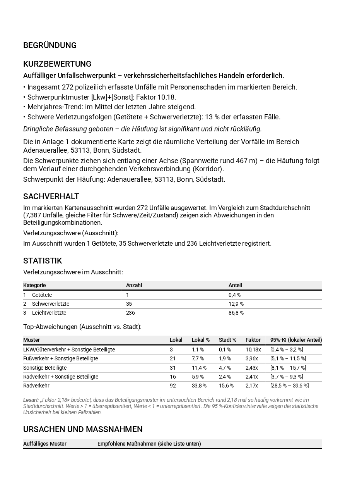
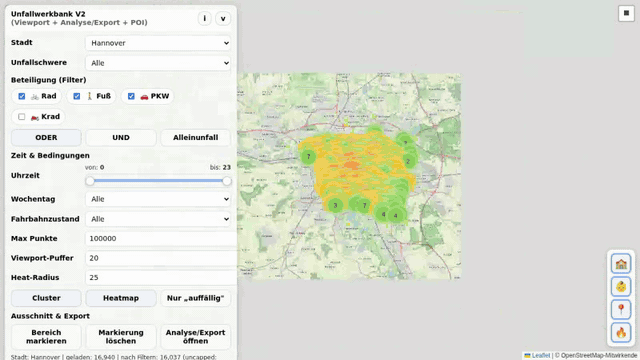

# Unfallwerkbank – Interaktive Unfallanalyse für deutsche Städte

> **Wo passieren Fahrradunfälle? Wo sind Schulwege gefährdet? Wo braucht es bessere Radinfrastruktur?**
>
> Die Unfallwerkbank macht amtliche Verkehrsunfalldaten (2016–2024) für ausgewählte deutsche Großstädte als interaktive Karte zugänglich – direkt im Browser, ohne Installation.

[](https://carstenartur.github.io/Unfallatlas/werkbank_v2.html)

---

## 🚀 Live-Demo & Dokumentation

| Ressource | Link |
|---|---|
| **Live-Demo (Werkbank V2)** | 👉 **[carstenartur.github.io/Unfallatlas/werkbank_v2.html](https://carstenartur.github.io/Unfallatlas/werkbank_v2.html)** |
| **Showcase (automatische Beispiel-Rotation)** | 🎠 [carstenartur.github.io/Unfallatlas/showcase.html](https://carstenartur.github.io/Unfallatlas/showcase.html) |
| **Vollständige Dokumentation** | 📖 [docs/DOKUMENTATION.md](docs/DOKUMENTATION.md) |
| **Architektur (Browser + Server + KI)** | 🏗️ [docs/architecture.md](docs/architecture.md) |
| **Server-API & Konfiguration** | 🔌 [docs/server-features.md](docs/server-features.md) |
| **Release-Checklist** | ✅ [docs/release-checklist.md](docs/release-checklist.md) |
| **Entwickler-Doku (Tests, CI)** | 🧰 [ARCHITECTURE.md](ARCHITECTURE.md) |

---

## ⏱️ In 60 Sekunden zur ersten Analyse

1. **[Live-Demo öffnen](https://carstenartur.github.io/Unfallatlas/werkbank_v2.html)** – läuft direkt im Browser
2. **Stadt wählen** – z. B. Bonn, Hannover, Berlin, Hamburg, …
3. **Filtern** – Unfallschwere, Beteiligung (🚲 🚶 🚗 🏍️ 🚛 🚌), Uhrzeit, Fahrbahnzustand
4. **Analysieren** – Cluster, Heatmap oder Hotspot-Erkennung aktivieren
5. **Exportieren** – Bezirksratsantrag als PDF/Word herunterladen oder Link teilen

> Alle Filter werden in der URL gespeichert – gleiche URL → gleiche Analyse. Ideal zum Teilen und Reproduzieren.

---

## 🔑 Wichtigste Funktionen

| Funktion | Beschreibung |
|---|---|
| **Filterkombinationen** | Schwere, Beteiligung (🚲 🚶 🚗 🏍️ 🚛 🚌 – ODER / UND / Alleinunfall), Uhrzeit, Wochentag, Fahrbahnzustand |
| **Cluster-Analyse** | Klick auf Cluster zeigt Beteiligungskombinationen mit Vergleich zum Stadtdurchschnitt |
| **Heatmap & Hotspots** | Dichteverteilung und automatische Erkennung überrepräsentierter Muster |
| **POI-Overlay** | Ab Zoomstufe 15: Schulen 🏫 und Kitas 🧒 auf der Karte – Schulwegsicherheit prüfen |
| **Bereichsauswahl** | Rechteck zeichnen → nur Unfälle in diesem Bereich auswerten |
| **Export als Bezirksratsantrag** | PDF / Word mit Sachverhalt, Statistik, Karte, POI-Analyse und Beschlussvorschlag |
| **Datenexport** | Unfallpunkte direkt als 📊 CSV, 🗺️ GeoJSON oder 📍 KML herunterladen |
| **Deterministische URLs** | Jede Analyse ist als Link teilbar und reproduzierbar |

---

## 📌 Konkrete Anwendungsbeispiele

### Beispiel 1: Auto-Fahrrad-Kollisionen am Bonner Hauptbahnhof

🚲 + 🚗 im **UND-Modus**, Heatmap aktiv → zeigt Häufungen von Rad-PKW-Kollisionen.

[→ Live in der Werkbank öffnen](https://carstenartur.github.io/Unfallatlas/werkbank_v2.html?city=Bonn&includeCyclist=1&includePedestrian=0&includeCar=1&includeMotorcycle=0&involvementMode=and&showCluster=0&showHeatmap=1&showOnlyAboveAverage=0&severity=all&dayType=all&roadCondition=all&hourFrom=0&hourTo=23&centerLat=50.7326&centerLon=7.0963&zoom=16&selSouth=50.7300&selWest=7.0910&selNorth=50.7355&selEast=7.1010)

[](https://carstenartur.github.io/Unfallatlas/werkbank_v2.html?city=Bonn&includeCyclist=1&includePedestrian=0&includeCar=1&includeMotorcycle=0&involvementMode=and&showCluster=0&showHeatmap=1&showOnlyAboveAverage=0&severity=all&dayType=all&roadCondition=all&hourFrom=0&hourTo=23&centerLat=50.7326&centerLon=7.0963&zoom=16&selSouth=50.7300&selWest=7.0910&selNorth=50.7355&selEast=7.1010)

### Beispiel 2: Fahrrad-Alleinunfälle (Infrastrukturmängel erkennen)

Nur 🚲 im **Alleinunfall-Modus** → deckt schlechten Belag, Bordsteinkanten und Gleise auf.

[→ Live in der Werkbank öffnen](https://carstenartur.github.io/Unfallatlas/werkbank_v2.html?city=Bonn&includeCyclist=1&includePedestrian=0&includeCar=0&includeMotorcycle=0&involvementMode=solo&showCluster=1&showHeatmap=0&showOnlyAboveAverage=0&severity=all&dayType=all&roadCondition=all&hourFrom=0&hourTo=23&centerLat=50.7350&centerLon=7.1000&zoom=13)

### Beispiel 3: Schulwegsicherheit – Unfälle neben Schulen und Kitas

🚲 + 🚶 im **ODER-Modus**, Berufsverkehr 6–18 Uhr, Zoom 16 → POIs (Schulen/Kitas) werden sichtbar.

[→ Live in der Werkbank öffnen](https://carstenartur.github.io/Unfallatlas/werkbank_v2.html?city=Bonn&includeCyclist=1&includePedestrian=1&includeCar=0&includeMotorcycle=0&involvementMode=or&showCluster=1&showHeatmap=0&showOnlyAboveAverage=0&severity=all&dayType=all&roadCondition=all&hourFrom=6&hourTo=18&centerLat=50.7350&centerLon=7.0950&zoom=16)

[](https://carstenartur.github.io/Unfallatlas/werkbank_v2.html?city=Bonn&includeCyclist=1&includePedestrian=1&includeCar=0&includeMotorcycle=0&involvementMode=or&showCluster=1&showHeatmap=0&showOnlyAboveAverage=0&severity=all&dayType=all&roadCondition=all&hourFrom=6&hourTo=18&centerLat=50.7350&centerLon=7.0950&zoom=16)

---

## 🎯 Für wen ist das?

| Zielgruppe | Nutzen |
|---|---|
| **Bezirksräte / Kommunalpolitik** | Datenbasierte Anträge zur Verkehrssicherheit erstellen – direkt als PDF/Word-Export |
| **Radverkehrsbeauftragte** | Unfallschwerpunkte identifizieren und Maßnahmen priorisieren |
| **Verkehrsplaner / Ingenieurbüros** | Open-Data-Analyse mit reproduzierbaren, teilbaren Links |
| **ADFC / Bürgerinitiativen** | Argumentationsgrundlage für Verbesserungen an konkreten Stellen |
| **Forschung / Journalismus** | Explorative Unfallanalyse mit amtlichen Daten (2016–2024) |

---

## 📸 Screenshots

| Cluster-Ansicht | Heatmap | Export-Modal |
|---|---|---|
| [](https://carstenartur.github.io/Unfallatlas/werkbank_v2.html) | [](https://carstenartur.github.io/Unfallatlas/werkbank_v2.html?showHeatmap=1&showCluster=0) | [](https://carstenartur.github.io/Unfallatlas/werkbank_v2.html?export=1) |

| Generierter PDF-Bezirksratsantrag |
|---|
| [](docs/screenshots/15-export-pdf-rendered.png) |

Weitere Screenshots und ausführliche Erklärungen: → [docs/DOKUMENTATION.md](docs/DOKUMENTATION.md)

---

## 🎭 Geführte Tour & Showcase

### Showcase – automatische Beispiel-Rotation

Die **[Showcase-Seite](https://carstenartur.github.io/Unfallatlas/showcase.html)** lädt die Beispiel-URLs aus der README nacheinander in einem `<iframe>` und wechselt automatisch alle 12 Sekunden. Ideal zum Präsentieren der Werkbank ohne manuelle Eingaben.

→ [showcase.html](showcase.html) öffnen · Play/Pause, Vor/Zurück, Dot-Navigation, Geschwindigkeit wählbar · Keyboard: ← →

### Geführte Tour in der Werkbank

Die **Werkbank V2** enthält einen eingebauten Tour-Player (`js/ua.tour.js`) der JSON-Sequenzen abspielt:

**Tour starten:**
- Klick auf **▶ Tour starten** im Panel unter „Geführte Tour" – startet die eingebaute Demo-Tour
- Oder URL-Parameter: `?tour=demo` (lädt `tours/demo.json`)
- Oder eigene Tour: `?tour=https://example.com/meine-tour.json`

**Tour-Overlay** zeigt:
- Aktuellen Schritt mit Beschreibung
- Fortschritt (z.B. „3 / 12")
- Play/Pause, Vor/Zurück, Beenden-Buttons

**Eigene Tour aufzeichnen (Recorder):**
1. Klick auf **⏺ Aufzeichnen** im Panel → roter REC-Badge erscheint
2. Normal in der Werkbank navigieren (Kartenausschnitt ändern, Filter setzen, Export öffnen)
3. Erneut auf den Button klicken → **Aufzeichnung stoppen**
4. Im Editor: Beschreibungen anpassen, Pausen editieren, Schritte löschen/sortieren
5. **Als JSON herunterladen** → in `tours/` ablegen und über `?tour=dateiname` aufrufen
6. **Vorschau abspielen** – direkt aus dem Editor heraus

**Tour-JSON-Format** (Beispiel):
```json
{
  "name": "Meine Tour",
  "steps": [
    { "action": "setCity",   "value": "Bonn",   "description": "Bonn laden",      "pause": 3000 },
    { "action": "flyTo",     "lat": 50.73, "lng": 7.10, "zoom": 14, "description": "Übersicht", "pause": 2000 },
    { "action": "setFilter", "filters": { "includeCyclist": true, "includeCar": true, "involvementMode": "and" }, "description": "Rad+Auto", "pause": 3000 },
    { "action": "openExport","description": "Export öffnen", "pause": 5000 },
    { "action": "closeExport","description": "Schließen",    "pause": 1000 }
  ]
}
```

---

## 🎬 Demo-Video

Das Projekt enthält einen automatisierten Demo-Ablauf auf Basis von [Playwright](https://playwright.dev/). Er durchläuft die wichtigsten Funktionen der Werkbank (Stadt wählen → Filter setzen → Heatmap → Legende → Export) und zeichnet das Ergebnis als Video auf.



<details>
<summary><strong>Demo-Video selbst erzeugen (klicken zum Aufklappen)</strong></summary>

```bash
npm install
npx playwright install --with-deps chromium
npm run demo
```

Das Video wird unter `test-results/` als `.webm`-Datei gespeichert und kann z. B. mit `ffmpeg` in GIF oder MP4 konvertiert werden:

```bash
# Beispiel: WebM → GIF (wie oben)
ffmpeg -i test-results/<video>.webm -vf "fps=5,scale=800:-1:flags=lanczos" docs/demo.gif

# Beispiel: WebM → MP4
ffmpeg -i test-results/<video>.webm -c:v libx264 -crf 23 demo.mp4
```

</details>

---

## 🛠️ CLI-Datenkonvertierung

Neben der Web-Werkbank enthält das Projekt Shell-/PowerShell-Skripte zum Konvertieren der Unfallatlas-Rohdaten in CSV und GeoJSON für Google Maps, Google Earth und GIS-Anwendungen.

### Quickstart

```sh
./convertAmt2gmaps.sh                          # Standard: Hannover, Fahrrad, 2016–2024
./convertAmt2gmaps.sh --city "Bonn"            # Stadtbasiert
./convertAmt2gmaps.sh --city "Berlin" --years "2023 2024"  # Jahre einschränken
```

<details>
<summary><strong>Erweiterte CLI-Nutzung (klicken zum Aufklappen)</strong></summary>

### Voraussetzungen

- sh, curl, unzip, awk, grep, sed, head/tail (Linux/macOS)
- PowerShell 7+ für `convertAmt2gmaps.ps1` (Windows)

### Region explizit setzen

```sh
./convertAmt2gmaps.sh --uland 03 --uregb 2 --ukreis 41 [--ugemeinde 001]
```

### Stadtbasiert filtern (≥ 100.000 Einwohner)

```sh
./convertAmt2gmaps.sh --update-city-cache       # Einmalig Cache erzeugen
./convertAmt2gmaps.sh --city "Frankfurt am Main"
./convertAmt2gmaps.sh --list-cities              # Alle Städte anzeigen
./convertAmt2gmaps.sh --search "ber"             # Suchen
```

### Beteiligungsarten filtern

```sh
./convertAmt2gmaps.sh --rad 1                   # Standard: Fahrrad
./convertAmt2gmaps.sh --rad 1 --fuss 1          # Fahrrad + Fußgänger
./convertAmt2gmaps.sh --pkw 1 --krad 1          # PKW + Kraftrad
```

### Ausgabe

```text
out/
 ├─ output2016.csv / .geojson
 ├─ …
 ├─ output2024.csv / .geojson
 ├─ output_all_years.csv
 └─ output_all_years.geojson
```

### Import in Google Maps

1. Google Maps → *Meine Orte* → *Karten* → *Karte erstellen*
2. CSV-Datei importieren → **WKT** als Geometrie, **Name** als Beschriftung
3. Max. 2000 Objekte pro Import

Die Karte kann anschließend direkt in Google Earth geöffnet werden.

Ausführliche Nutzungsinformationen (Shell + PowerShell): → [usage.md](usage.md)

</details>

---

## 🐳 Docker

Die Unfallwerkbank ist als fertiges Docker-Image unter `ghcr.io/carstenartur/unfallatlas` verfügbar. Die Docker-Distribution enthält gegenüber der GitHub-Pages-Version einen zusätzlichen **„🎬 Als Video exportieren"-Button**, der den kompletten Analyse-Ablauf als GIF-Video generiert.

### Schnellstart

```bash
# Image ziehen und starten
docker run -p 8000:8000 ghcr.io/carstenartur/unfallatlas

# Browser öffnen → http://localhost:8000
```

### Mit Docker Compose

```bash
docker compose up
# → http://localhost:8000
```

### Lokal bauen

```bash
docker build -t unfallatlas .
docker run -p 8000:8000 unfallatlas
```

### Video-Export-Funktion (nur Docker)

Nach dem Start der Docker-Version erscheint im Export-Bereich ein **„🎬 Als Video exportieren"-Button**. Dieser:

1. Sammelt alle aktuellen Einstellungen (Stadt, Filter, Kartenposition, markierter Bereich)
2. Schickt sie an den integrierten Backend-Service
3. Playwright spielt den kompletten Ablauf animiert durch – von der Standardansicht über die Filterauswahl bis zum Bezirksratsantrag
4. Das fertige GIF wird automatisch heruntergeladen

> **Hinweis:** Der Button ist ausschließlich in der Docker-Distribution sichtbar. Auf GitHub Pages ist er nicht vorhanden (graceful degradation).

---

## ⚙️ Betriebsarten / Betriebs-Matrix

Die Werkbank unterstützt vier Betriebsarten mit unterschiedlichem
Funktions­umfang.  Alle Kernfunktionen (Karte, Filter, Cluster, Heatmap,
PDF-/Word-Export, CSV/GeoJSON/KML) sind **immer** verfügbar – Server und
KI sind optionale Erweiterungen.

| Funktion | Browser-only<br>(GitHub Pages) | Lokaler Server<br>**ohne** `GEMINI_API_KEY` | Lokaler Server<br>**mit** `GEMINI_API_KEY` | Docker |
|---|:---:|:---:|:---:|:---:|
| Karte, Filter, Cluster, Heatmap, Hotspots | ✅ | ✅ | ✅ | ✅ |
| POI-Overlay (Schulen, Kitas)              | ✅ | ✅ | ✅ | ✅ |
| Bereichsauswahl, geteilte URLs            | ✅ | ✅ | ✅ | ✅ |
| CSV / GeoJSON / KML-Export                | ✅ | ✅ | ✅ | ✅ |
| **Deterministischer PDF-/Word-Export**    | ✅ | ✅ | ✅ | ✅ |
| Geführte Tour & Recorder                  | ✅ | ✅ | ✅ | ✅ |
| **Politische Recherche** (Hannover, Berlin, Bonn, Hamburg) | ❌ | ✅ | ✅ | ✅ |
| **KI-Bewertung v2** (mit Fallback)        | ❌ | ✅ Fallback¹ | ✅ KI | ✅ (KI nur mit Key) |
| **KI-Bewertung v1** (`/api/ai/export-assessment`) | ❌ | ❌ (`503`) | ✅ | ✅ (nur mit Key) |
| **Video-Export** (`.gif`)                 | ❌ | ✅ | ✅ | ✅ |
| Konfiguration nötig                       | – | Node 18+ installieren, `npm run start:server` | zusätzlich `GEMINI_API_KEY` setzen | nur `docker run …` (optional `-e GEMINI_API_KEY=…`) |

¹ Ohne `GEMINI_API_KEY` antwortet `POST /api/ai/export-assessment/v2`
mit `200 OK` und `source: "fallback"` (deterministischer, datengestützter
Output ohne KI-Texte). Wer das nicht will, setzt `withFallback: false` im
Body und erhält dann `503`.

### Schnellauswahl

- **Nur ausprobieren / präsentieren** → Browser-only (Live-Demo).
- **PDF-Antrag schreiben + politische Recherche** → lokaler Server ohne KI.
- **Zusätzlich KI-Vorschläge & Maßnahmensteckbriefe** → lokaler Server mit
  `GEMINI_API_KEY` (Google Gemini).
- **Bezirksrats-Präsentationen mit Animations-GIF** → Docker.

### Architekturüberblick (Kurzfassung)

- **Browser** ist autark und enthält den deterministischen Export-/Analyse­
  pfad ([`js/ua.export_v2.js`](js/ua.export_v2.js),
  [`js/ua.report_v2.js`](js/ua.report_v2.js)).
- **`server/ai/`** stellt die optionale KI-Bewertung bereit (Gemini,
  strikte Schema-Validierung, Cache, Reparatur­versuch, Fallback).
  → [`server/ai/README.md`](server/ai/README.md)
- **`server/political-context/`** recherchiert politische Vorgänge in
  Stadt-/Bezirks-Portalen. Funktioniert serverseitig, weil der Browser die
  externen Portale wegen CORS nicht direkt aufrufen kann.
  → [`server/political-context/README.md`](server/political-context/README.md)
- **Server ist optional**, **KI ist optional**, bestehende Kernfunktionen
  bleiben ohne KI nutzbar. Details:
  [`docs/architecture.md`](docs/architecture.md).

### Konfiguration (Auszug)

| Variable | Standard | Wirkung |
|---|---|---|
| `PORT` | `8000` | Port des Express-Servers |
| `GEMINI_API_KEY` | – | aktiviert die KI-Bewertung; ohne Key bleibt der Fallback aktiv |
| `AI_ASSESSMENT_MODEL` | `gemini-2.0-flash` | Gemini-Modell für die Bewertung |
| `AI_ASSESSMENT_TIMEOUT_MS` | `30000` | Timeout pro KI-Request (ms) |
| `AI_ASSESSMENT_MAX_RETRIES` | `2` | Retries bei `429`/`5xx` |
| `PORTAL_SEARCH_TIMEOUT_MS` | `10000` | Timeout pro Portal-Anfrage (ms) der politischen Recherche |
| `AI_CACHE_PATH`, `AI_JOBS_PATH` | – | optionale Persistenz von KI-Cache und Job-Queue |

Vollständige Liste aller Endpunkte, Request-/Response-Beispiele,
Fehlerfälle und Env-Variablen: → [`docs/server-features.md`](docs/server-features.md).
Vor jedem Release laufen die Smoke-Tests aus
[`docs/release-checklist.md`](docs/release-checklist.md).

---

## Datenquelle & Lizenz

| Thema | Details |
|---|---|
| **Unfallatlas** | [unfallatlas.statistikportal.de](https://unfallatlas.statistikportal.de/) |
| **Open-Data-Downloads** | [opengeodata.nrw.de/…/unfallatlas](https://www.opengeodata.nrw.de/produkte/transport_verkehr/unfallatlas/) |
| **Datenlizenz** | [Datenlizenz Deutschland – Namensnennung – Version 2.0](https://www.govdata.de/dl-de/by-2-0) |
| **Koordinatensystem** | WGS84 (EPSG:4326, exportiert aus EPSG:25832) |

### Verwendete Bibliotheken

- [Leaflet](https://leafletjs.com/) – BSD-2-Clause · [Leaflet.markercluster](https://github.com/Leaflet/Leaflet.markercluster) – MIT · [leaflet.heat](https://github.com/Leaflet/Leaflet.heat) – MIT
- [pdfMake](https://pdfmake.github.io/docs/) · [docx.js](https://docx.js.org/) · [FileSaver.js](https://github.com/nicholasnet/FileSaver.js)
- Kartenkacheln: © [OpenStreetMap-Mitwirkende](https://www.openstreetmap.org/copyright)

---

## Weiterführende Informationen

- [Werkbank V2 – Features & POI-Integration](WERKBANK_V2.md)
- [Vollständige Dokumentation mit Screenshots](docs/DOKUMENTATION.md)
- [Architektur-Überblick (Browser + Server + KI)](docs/architecture.md)
- [Server-API & Konfiguration](docs/server-features.md)
- [Release-Checklist](docs/release-checklist.md)
- [Architektur, Tests & Entwicklung](ARCHITECTURE.md)
- [SimRa – Beinaheunfälle im Radverkehr](https://urban-digital.de/mit-simra-sicherheit-im-radverkehr-herausfinden-wo-sich-beinaheunfaelle-im-radverkehr-haeufen/)
- [Nature: Bicycle crash data](https://www.nature.com/articles/s43588-022-00318-w)
- [Deutschlandatlas – Pendlerverflechtungen](https://www.deutschlandatlas.bund.de/DE/Karten/Wie-wir-uns-bewegen/100-Pendlerdistanzen-Pendlerverflechtungen.html)
- [Strava Heatmap](https://www.strava.com/heatmap)
- [Radverkehr in Deutschland](https://www.radverkehr-in-deutschland.de/)
- [Fahrradunfälle](https://fahrrad-unfallorte.de/)
