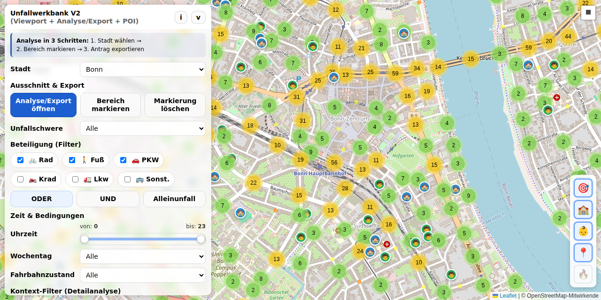
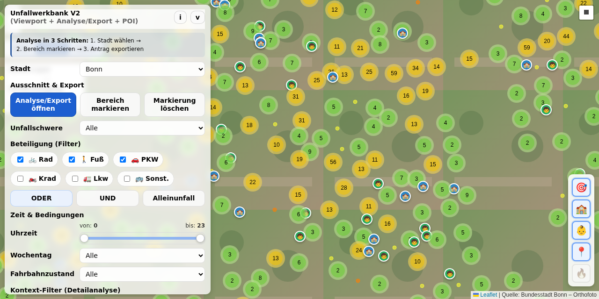
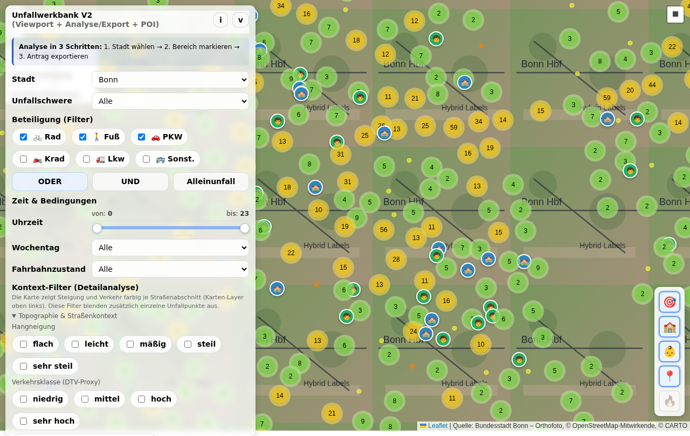
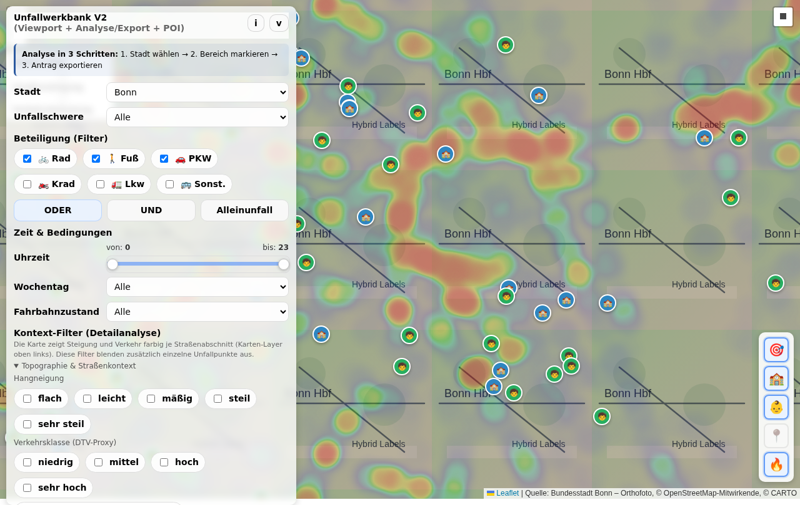

# Unfallwerkbank – Nutzungsanleitung

Diese Anleitung führt von der ersten Kartenansicht bis zur teilbaren Analyse und zum Export. Sie richtet sich an Menschen, die Verkehrsunfälle an konkreten Orten untersuchen möchten. Hinweise für Betrieb und Entwicklung stehen gesammelt unter [Betrieb und Entwicklung](#betrieb-und-entwicklung).

> **Screenshots sind Einstiegspunkte:** Jeder Screenshot ist mit dem dazugehörigen Zustand der öffentlichen Werkbank verknüpft. Ein Klick öffnet die gezeigte Stadt, den Kartenausschnitt und die adressierbaren Filter. Bei Screenshots eines geöffneten Dialogs steht zusätzlich dabei, welcher Knopf anschließend zu wählen ist.

**[Werkbank öffnen](https://carstenartur.github.io/Unfallatlas/werkbank_v2.html?city=Hannover&severity=all&dayType=all&roadCondition=all&hourFrom=0&hourTo=23&maxPoints=100000&viewportPaddingPct=20&heatRadius=25&includeCyclist=1&includePedestrian=1&includeCar=1&includeMotorcycle=0&includeGkfz=0&includeSonstig=0&involvementMode=or&showCluster=1&showHeatmap=0&showOnlyAboveAverage=0&showSchools=1&showKindergartens=1&showArgumentation=1&mapMode=standard&orthophotoOpacity=92&centerLat=52.3759&centerLon=9.7320&zoom=12)** · **[Praxisbeispiele](#praxisbeispiele)** · **[Methodik und Grenzen](#methodik-und-grenzen)** · **[Datenstatus](https://carstenartur.github.io/Unfallatlas/data-status/)**

## Inhalt

1. [Schnellstart](#schnellstart)
2. [Der typische Arbeitsablauf](#der-typische-arbeitsablauf)
3. [Filter und Beteiligungsmodi](#filter-und-beteiligungsmodi)
4. [Karte, Auswahl und Darstellungen](#karte-auswahl-und-darstellungen)
5. [Kontext: Schulen, Kitas, Straßen und Gelände](#kontext-neu)
6. [Analyse teilen](#analyse-teilen)
7. [Export und Bezirksratsantrag](#export-und-bezirksratsantrag)
8. [Praxisbeispiele](#praxisbeispiele)
9. [Methodik und Grenzen](#methodik-und-grenzen)
10. [Häufige Fragen](#häufige-fragen-faq)
11. [Betrieb und Entwicklung](#betrieb-und-entwicklung)

---

## Schnellstart

Die öffentliche Browser-Version benötigt keine Installation:

1. [Werkbank mit einem definierten Hannover-Startzustand öffnen](https://carstenartur.github.io/Unfallatlas/werkbank_v2.html?city=Hannover&severity=all&dayType=all&roadCondition=all&hourFrom=0&hourTo=23&maxPoints=100000&viewportPaddingPct=20&heatRadius=25&includeCyclist=1&includePedestrian=1&includeCar=1&includeMotorcycle=0&includeGkfz=0&includeSonstig=0&involvementMode=or&showCluster=1&showHeatmap=0&showOnlyAboveAverage=0&showSchools=1&showKindergartens=1&showArgumentation=1&mapMode=standard&orthophotoOpacity=92&centerLat=52.3759&centerLon=9.7320&zoom=12).
2. Im Bedienfeld eine Stadt auswählen.
3. Beteiligte, Schwere, Zeitraum und weitere Filter setzen.
4. Den interessierenden Kartenausschnitt heranzoomen oder markieren.
5. Cluster beziehungsweise Heatmap vergleichen.
6. Den Link kopieren oder **Analyse/Export öffnen** wählen.

### Was Sie auf der Seite sehen

- **Bedienfeld:** Stadt, Filter, Beteiligungsmodus, Kontext- und Darstellungsoptionen.
- **Karte:** Unfallpunkte, Cluster, Heatmap, Auswahlfläche und verfügbare Zusatzebenen.
- **Statuszeile:** Anzahl und Ladezustand der aktuell berücksichtigten Daten.
- **Analyse/Export:** Zusammenfassung, Tabellen, Datenexport und Dokumententwurf.

Die Werkbank arbeitet interaktiv. Nach einer Änderung sollte die Statusanzeige vollständig aktualisiert sein, bevor Zahlen oder Screenshots übernommen werden.

---

## Der typische Arbeitsablauf

### 1. Fragestellung festlegen

Eine gute Analyse beginnt mit einer überprüfbaren Frage, beispielsweise:

- Wo häufen sich Unfälle mit Rad- und Pkw-Beteiligung?
- An welchen Stellen treten Fahrrad-Alleinunfälle auf?
- Welche Unfallorte liegen im Umfeld von Schulen oder Kitas?
- Wie unterscheidet sich der Berufsverkehr vom gesamten Tagesverlauf?
- Welche Stellen sollten vor Ort oder mit weiteren Daten genauer geprüft werden?

### 2. Stadt und Datenumfang wählen

Die Stadtauswahl bestimmt den Datenbestand. Verfügbare Jahrgänge und Zusatzdaten unterscheiden sich je nach Ort. Der [Städte-/Regionen-Katalog](CITY_CATALOG.md) und der [öffentliche Datenstatus](https://carstenartur.github.io/Unfallatlas/data-status/) zeigen den aktuellen Umfang.

### 3. Filter schrittweise setzen

Beginnen Sie möglichst breit und schränken Sie anschließend ein. Prüfen Sie nach jedem Schritt, ob die Fallzahl noch aussagekräftig ist. Sehr viele gleichzeitige Filter können eine scheinbar präzise, tatsächlich aber sehr kleine Stichprobe erzeugen.

### 4. Räumlichen Ausschnitt festlegen

Verschieben und zoomen Sie die Karte oder markieren Sie einen Bereich. Der Export bezieht sich auf die markierte Fläche; ohne Markierung ist der sichtbare Kartenausschnitt maßgeblich.

### 5. Darstellung vergleichen

Cluster zeigen einzelne Orte und lokale Verdichtungen. Eine Heatmap zeigt räumliche Dichte. Beide Ansichten beantworten unterschiedliche Fragen und sollten nicht als identische Statistik gelesen werden.

### 6. Ergebnis teilen oder exportieren

Kopieren Sie den Link für eine reproduzierbare Übergabe. Für einen Bericht öffnen Sie den Exportdialog und prüfen den Text sowie alle Zahlen vor der Weiterverwendung.

---

## Filter und Beteiligungsmodi

### Beteiligte

Je nach Datensatz stehen unter anderem folgende Beteiligungsarten zur Verfügung:

- Radverkehr
- Fußverkehr
- Pkw
- Kraftrad
- Güterkraftfahrzeuge
- sonstige erfasste Beteiligte

### ODER, UND und Alleinunfall

| Modus | Bedeutung | Beispiel |
|---|---|---|
| **ODER** | Mindestens eine ausgewählte Beteiligungsart kommt vor. | Rad **oder** Fuß |
| **UND** | Alle ausgewählten Beteiligungsarten kommen im selben Unfall vor. | Rad **und** Pkw |
| **Alleinunfall** | Die ausgewählte Beteiligungsart wird ohne andere erfasste Beteiligungsart betrachtet. | Fahrrad-Alleinunfall |

Der Unterschied ist wesentlich. **Rad ODER Pkw** ist eine breite Menge; **Rad UND Pkw** untersucht nur gemeinsame Beteiligung.

### Unfallschwere

Die Schwerefilter beruhen auf den im Unfallatlas veröffentlichten Kategorien. Eine Auswahl verändert nur die sichtbare und ausgewertete Teilmenge; sie ändert nicht die Grundgesamtheit des städtischen Datensatzes.

### Tageszeit, Wochentag und Fahrbahnzustand

- **Stundenbereich:** etwa 6–9 Uhr oder 15–18 Uhr.
- **Tagestyp:** alle Tage, Werktage oder Wochenende.
- **Fahrbahnzustand:** beispielsweise trocken, nass/feucht oder winterglatt, soweit erfasst.

Zeit- und Zustandsfilter helfen beim Vergleich von Situationen. Sie beweisen jedoch nicht, dass Tageszeit oder Fahrbahnzustand die Ursache eines Unfalls waren.

### Fahrrad-Alleinunfälle

Der Alleinunfall-Modus kann Stellen sichtbar machen, an denen eine örtliche Prüfung von Belag, Kanten, Gleisen, Entwässerung, Sicht oder Führung sinnvoll ist.

> Ein Cluster von Alleinunfällen ist ein **Prüfhinweis**, kein automatischer Nachweis eines Infrastrukturmangels.

---

## Karte, Auswahl und Darstellungen

### Cluster-Ansicht

Cluster fassen nahe Unfallpunkte abhängig von Zoomstufe und Kartenposition zusammen. Beim Hineinzoomen werden kleinere Gruppen und schließlich einzelne Punkte sichtbar.

### Heatmap-Ansicht

Die Heatmap betont räumliche Dichte. Ihre Farbintensität hängt auch von Zoomstufe, Radius und sichtbarem Ausschnitt ab. Sie eignet sich zur Orientierung, nicht zum Ablesen exakter Fallzahlen.

### Bereich markieren

Mit **Bereich markieren** lässt sich ein Rechteck festlegen. Die Grenzen werden als `selSouth`, `selWest`, `selNorth` und `selEast` in der URL gespeichert.

Für belastbare Vergleiche sollte der Bereich fachlich begründet sein, zum Beispiel durch einen Knoten, einen Straßenabschnitt oder das Umfeld einer Einrichtung. Eine nachträglich nur um sichtbare Unfallpunkte gezogene Grenze kann die Aussage verzerren.

### Kartenmodi

Die verfügbaren Kartenmodi helfen bei unterschiedlichen Aufgaben:

| Standardkarte | Orthofoto |
|---|---|
|  |  |

| Hybrid | Analyseansicht |
|---|---|
|  |  |

Orthofotos und Hybridkarten können je nach Stadt, Datenanbieter und Erreichbarkeit der Kartendienste abweichen. Die Standardkarte bleibt die robusteste Orientierungsebene.

### Nur „auffällig“

Der Hotspot- beziehungsweise Auffälligkeitsmodus hebt lokal überrepräsentierte Muster hervor. Das Ergebnis hängt von Raster, Vergleichsmenge, Filtern und Fallzahl ab. Verwenden Sie ihn als Suchhilfe und prüfen Sie auffällige Stellen anschließend in der normalen Kartenansicht und in den Rohzahlen.

---

## Kontext (neu)

### Schulen und Kitas

Bei ausreichender Zoomstufe können Schulen und Kitas als POIs erscheinen. Dadurch lässt sich erkennen, ob gefilterte Unfallstellen im Umfeld sensibler Einrichtungen liegen.

Die POIs stammen, soweit vorhanden, aus OpenStreetMap. Vollständigkeit und Aktualität können lokal variieren. Die räumliche Nähe zu einer Einrichtung beweist weder einen Schulwegunfall noch einen ursächlichen Zusammenhang.

### Straßen- und Geländekontext

Je nach Stadt können weitere Felder verfügbar sein:

| Kontext | Einordnung |
|---|---|
| Hangneigung oder Höhe | Aus einem Geländemodell abgeleiteter räumlicher Kontext |
| OSM-Straßenattribute | Zum Beispiel Straßenklasse, Oberfläche, Fahrstreifen oder zulässige Geschwindigkeit, soweit vorhanden |
| Verkehrsklasse/DTV-Proxy | Projektinterne Grobschätzung aus der OSM-Straßenklasse |
| Nur gematchte Straßen | Begrenzt auf Unfallpunkte, die einer Straße zugeordnet werden konnten |

**Der Verkehrsproxy ist keine gemessene Verkehrsdichte.** Er darf nicht als Zählwert, amtlicher DTV oder Belastungsnachweis ausgegeben werden. Kontextdaten sind außerdem keine Unfallursachen. Details: [Kontextanreicherung](enrichment.md).

---

## Analyse teilen

### Reproduzierbarer Link

**Link kopieren** übernimmt den adressierbaren Zustand der Werkbank, darunter insbesondere:

- Stadt,
- Beteiligungs- und Sachfilter,
- Cluster/Heatmap und Kartenmodus,
- Kartenmittelpunkt und Zoom,
- markierte Auswahlgrenzen,
- unterstützte Kontextfilter.

Das macht eine Analyse nachvollziehbarer als ein isolierter Screenshot. Empfänger:innen können zoomen, einzelne Punkte prüfen und Filter verändern.

### Screenshot plus Link

Für Veröffentlichungen oder Anträge ist die Kombination sinnvoll:

1. Screenshot als schnelle visuelle Orientierung,
2. Deep-Link als überprüfbarer Einstieg,
3. Angabe von Datenstand und Filtern,
4. kurze fachliche Einordnung der Grenzen.

Alle in dieser Anleitung verwendeten Anwendungsscreenshots folgen diesem Muster.

---

## Export und Bezirksratsantrag

### Exportdialog öffnen

Öffnen Sie zunächst den gewünschten Kartenzustand und wählen Sie anschließend **Analyse/Export öffnen**.

Der Screenshot zeigt den Zustand nach dem Öffnen des Dialogs. Der Link führt absichtlich zuerst zur zugrunde liegenden Analyse, damit kein großer Dialog ungefragt die Karte verdeckt.

### Was der Export übernehmen kann

Abhängig von Betriebsart, Daten und gewählten Optionen enthält der Export unter anderem:

- Ort, Zeitraum, Filter und räumliche Auswahl,
- Fallzahlen und Verteilung der Unfallschwere,
- Beteiligungskombinationen,
- Karten- und Tabellenansichten,
- Schulen/Kitas und weitere verfügbare Kontexte,
- Quellen- und Methodikhinweise,
- einen bearbeitbaren Entwurf für einen kommunal passenden Antrag.

### Word, PDF und Datenformate

| Ausgabe | Typischer Zweck |
|---|---|
| Word | Text und Aufbau weiterbearbeiten |
| PDF | Ansicht weitergeben oder archivieren |
| CSV | Tabellenkalkulation und eigene Auswertung |
| GeoJSON | GIS- und Webkartenverarbeitung |
| KML | Google Earth und kompatible Kartenwerkzeuge |

### Vor dem Weitergeben prüfen

- Stimmen Ort, Zeitraum und Auswahlfläche?
- Sind Fallzahlen in Karte, Text und Tabellen konsistent?
- Sind Aussagen als Beobachtung, Vergleich oder Hypothese gekennzeichnet?
- Werden Proxy- und Kontextdaten korrekt bezeichnet?
- Ist der Beschlussvorschlag lokal zuständig und fachlich angemessen?
- Sind sensible oder personenbezogene Ergänzungen entfernt?

Der Antragstext ist ein **Entwurf**. Er ersetzt weder Ortsbegehung noch Planung, Rechtsprüfung oder politische Abstimmung.

### Video-Export (Docker)

Ein servergestützter Betrieb kann eine Animation der Analyse erzeugen. Diese Funktion ist vom früher in README und Nutzerdokumentation eingebetteten Demo-GIF zu unterscheiden: Das veraltete, fest eingebettete Demo-Medium wurde entfernt. Aktuelle Videos werden bei Bedarf aus einem konkreten Analysezustand erzeugt. Bedienung und Provenienz: [Docker und Videoexport](docker.md#video-export-funktion-server-betrieb-node-oder-docker).

---

## Praxisbeispiele

### Beispiel 1: Rad-Pkw-Unfälle am Bonner Hauptbahnhof

**Frage:** Wo liegen im markierten Bahnhofsumfeld Unfälle, an denen Rad- und Pkw-Verkehr gemeinsam beteiligt waren?

**Konfiguration:** Bonn, Rad + Pkw, UND, Heatmap, markierter Bereich.

**Sinnvolle nächste Schritte:** Einzelpunkte prüfen, Kreuzungen und Zufahrten vor Ort ansehen, Verkehrsbelastung und Planungsunterlagen ergänzen.

### Beispiel 2: Fahrrad-Alleinunfälle

**Frage:** Wo treten Unfälle mit alleiniger Fahrradbeteiligung gehäuft auf?

**Sinnvolle nächste Schritte:** Belag, Gleise, Bordsteine, Sicht, Entwässerung, Gefälle und Führung prüfen; Meldedaten oder Ortskenntnis ergänzen.

### Beispiel 3: Rad- und Fußverkehr im Schul- und Kita-Umfeld

**Frage:** Welche gefilterten Unfallstellen liegen in der Nähe sichtbarer Schulen und Kitas?

**Sinnvolle nächste Schritte:** tatsächliche Schulwege und Eingänge bestimmen, Tageszeiten prüfen und kommunale Schulwegpläne hinzuziehen.

### Beispiel 4: Bericht für einen markierten Bereich

**Frage:** Wie lässt sich eine konkrete Auswahl mit Zeit- und Beteiligungsfilter dokumentieren?

Nach dem Öffnen **Analyse/Export öffnen** wählen und Zahlen, Karte und Text gemeinsam prüfen.

---

## Methodik und Grenzen

### Datengrundlage

Die Werkbank verwendet veröffentlichte Unfallatlas-Daten. Sie zeigt Unfallorte und die dort bereitgestellten Merkmale, nicht vollständige Unfallakten. Der verfügbare Zeitraum und die Datenfelder können sich nach Jahr und Stadt unterscheiden.

### Polizeilich erfasste Unfälle und Dunkelziffer

Nicht gemeldete Unfälle, Beinaheunfälle und Ereignisse außerhalb der veröffentlichten Auswahl fehlen. Besonders bei Alleinunfällen und leichteren Ereignissen kann die Dunkelziffer relevant sein. Die Werkbank darf daher nicht als vollständiges Bild aller Gefährdungen verstanden werden.

### Räumliche Genauigkeit

Koordinaten beschreiben den veröffentlichten Unfallort. Sie können generalisiert sein und bilden nicht zwingend Fahrtrichtung, exakte Konfliktfläche oder Unfallhergang ab. Aussagen auf Gebäude-, Fahrstreifen- oder Zentimeterebene sind daraus nicht zulässig.

### Korrelation ist keine Ursache

Ein Unfallpunkt neben einer Schule, auf einer Steigung oder an einer hoch klassifizierten Straße belegt keinen kausalen Zusammenhang. Die Werkbank hilft, Hypothesen und Prüfaufträge zu formulieren. Ursachen erfordern weitere Informationen.

### Kleine Fallzahlen

Prozentwerte, Quotienten und „überrepräsentierte“ Kombinationen können bei kleinen Fallzahlen stark schwanken. Bericht und Diskussion sollten stets die absoluten Fallzahlen nennen.

### Mehrjahres-Trend

Mehrere Jahrgänge verbessern die Beobachtungsbasis, können aber Änderungen der Infrastruktur, Mobilität, Erfassung oder äußere Sondereffekte überdecken. Trendangaben müssen die verwendeten Jahre und die Zahl der Fälle je Jahr ausweisen.

### Volkswirtschaftliche Kosten

Etwaige Kostenschätzungen beruhen auf pauschalen Bewertungsansätzen und sind keine Schadensabrechnung für einzelne Ereignisse. Annahmen und Bezugsjahr müssen im Bericht sichtbar bleiben.

### Maßnahmenkatalog und KI-Unterstützung

Vorgeschlagene Maßnahmen oder KI-generierte Textbausteine sind Optionen für die weitere Prüfung. Sie sind keine automatisch geeigneten, finanzierten oder rechtlich angeordneten Maßnahmen. Deterministische Daten und KI-Text müssen unterscheidbar bleiben.

### Qualität eines belastbaren Exports

Ein guter Export macht mindestens transparent:

- Datenstand und Datenquelle,
- räumliche Auswahl,
- aktive Filter,
- absolute Fallzahlen,
- Vergleichsmaßstab,
- Proxy- und Schätzwerte,
- fachliche Grenzen,
- den Link zur zugrunde liegenden Analyse.

---

## URL-Parameter (Referenz)

Links werden normalerweise über **Link kopieren** erzeugt; eine manuelle Bearbeitung ist nicht nötig. Die wichtigsten Parameter sind:

| Bereich | Parameter |
|---|---|
| Stadt | `city` |
| Beteiligte | `includeCyclist`, `includePedestrian`, `includeCar`, `includeMotorcycle`, `includeGkfz`, `includeSonstig` |
| Verknüpfung | `involvementMode=or|and|solo` |
| Sachfilter | `severity`, `dayType`, `roadCondition`, `hourFrom`, `hourTo` |
| Darstellung | `showCluster`, `showHeatmap`, `showOnlyAboveAverage`, `mapMode`, `orthophotoOpacity` |
| Zusatzebenen | `showSchools`, `showKindergartens`, `showArgumentation` |
| Karte | `centerLat`, `centerLon`, `zoom` |
| Auswahl | `selSouth`, `selWest`, `selNorth`, `selEast` |
| Kontext | unter anderem `ctxSlope`, `ctxTraffic`, `ctxOnlyMatched` |

Unbekannte oder für den geladenen Datensatz nicht verfügbare Kontextparameter dürfen nicht stillschweigend als wirksamer Filter interpretiert werden.

---

## Tour-System (Player + Recorder)

Eine geführte Tour und die Showcase-Seite können für Präsentationen nützlich sein. Sie ersetzen nicht den Deep-Link zu einer überprüfbaren Analyse. Details: [Tour und Showcase](tour-and-showcase.md).

## Showcase-Seite

Der [Showcase](https://carstenartur.github.io/Unfallatlas/showcase.html) bettet ausgewählte Abläufe ein. Für fachliche Übergaben sollte zusätzlich die konkrete Werkbank-URL angegeben werden.

---

## Häufige Fragen (FAQ)

### Warum sehe ich nach einem Filterwechsel weniger Punkte als erwartet?

Mehrere Filter wirken gemeinsam. Prüfen Sie Beteiligungsmodus, Schwere, Zeit, Tagestyp, Fahrbahnzustand und eine möglicherweise vorhandene Auswahlfläche.

### Warum erscheinen Schulen und Kitas nicht?

POIs werden erst bei ausreichender Zoomstufe und nur für Städte mit verfügbarem POI-Datensatz angezeigt.

### Warum unterscheidet sich die Heatmap vom Clusterbild?

Cluster gruppieren Punkte; die Heatmap glättet Dichte über einen Radius. Zoomstufe und Radius verändern die Darstellung.

### Kann ich aus einer Häufung direkt eine Maßnahme ableiten?

Nein. Eine Häufung priorisiert die weitere Prüfung. Geeignete Maßnahmen hängen vom Unfallhergang, Verkehrsraum, Belastungen, Regelwerk, Zuständigkeit und örtlichen Randbedingungen ab.

### Ist die Verkehrsklasse eine echte Verkehrszählung?

Nein. Die als DTV-Proxy gekennzeichnete Klasse ist eine Grobschätzung aus der OSM-Straßenklasse.

### Warum öffnet ein Export-Screenshot zunächst die Karte?

Ein Exportdialog verdeckt einen großen Teil der Anwendung und ist ein vorübergehender UI-Zustand. Der Link öffnet deshalb die exakt zugrunde liegende Analyse; anschließend **Analyse/Export öffnen** wählen.

### Wie erkenne ich die Datenaktualität?

Über den [öffentlichen Datenstatus](https://carstenartur.github.io/Unfallatlas/data-status/) und die Angaben im Export.

---

## Datenquelle & Lizenz

Die Unfalldaten stammen aus dem [Unfallatlas des Statistikportals der deutschen Bundesländer](https://unfallatlas.statistikportal.de/). Karten- und POI-Daten können Inhalte von OpenStreetMap-Mitwirkenden enthalten. Maßgeblich sind die jeweils in Anwendung, Export und [Credits](credits.md) angegebenen Quellen und Lizenzen.

---

## CLI-Skripte (Kurzreferenz)

Die Weboberfläche ist der empfohlene Einstieg. Für Konvertierung, CSV/GeoJSON-Ausgaben und eigene Datenläufe stehen Shell- und PowerShell-Werkzeuge zur Verfügung: [usage.md](../usage.md).

---

## Betrieb und Entwicklung

Die folgenden Inhalte sind bewusst aus der Nutzerführung ausgelagert:

| Aufgabe | Dokument |
|---|---|
| Lokaler oder Docker-Betrieb | [Docker](docker.md) und [Site-Build](site-build.md) |
| Datenstatus, Aktualisierung und Veröffentlichung | [DATA_STATUS.md](../DATA_STATUS.md) |
| Städte und Datenabdeckung | [CITY_CATALOG.md](CITY_CATALOG.md) |
| Architektur | [ARCHITECTURE.md](../ARCHITECTURE.md) und [docs/architecture.md](architecture.md) |
| Serverfunktionen und API | [server-features.md](server-features.md) |
| Kontextdaten erzeugen | [context-generation.md](context-generation.md) und [enrichment.md](enrichment.md) |
| Tests und Release-QA | [tests/README.md](../tests/README.md) und [release-checklist.md](release-checklist.md) |
| Dokumentationsmedien erzeugen und prüfen | [screenshots/README.md](screenshots/README.md) |

Frühere technische Abschnitte dieser Datei sind damit nicht entfallen, sondern in die jeweils zuständige Betriebs-, Daten- oder Architekturdokumentation verschoben. So bleibt die Nutzungsanleitung auf Bedienung, Interpretation und nachvollziehbare Ergebnisse konzentriert.
