# Unfallwerkbank V2 – Dokumentation

## Überblick

Die **Unfallwerkbank V2** ist eine interaktive Webanwendung zur Visualisierung und Analyse
von [Unfallatlas](https://unfallatlas.statistikportal.de/)-Daten (Open Data) für deutsche Städte.
Sie ermöglicht:

- **Filterung** nach Stadt, Unfallschwere, Beteiligungsart (Rad, Fuß, PKW, Krad), Uhrzeit und Straßenzustand
- **Darstellung** der Unfälle als Cluster-Karte oder Heatmap
- **Bereich markieren** – gezieltes Auswählen eines Kartenausschnitts für die Auswertung
- **POI-Anzeige** – Schulen, Kindergärten und Kitas in der Nähe von Unfallschwerpunkten sichtbar machen
- **Export** als PDF oder Word-Dokument – z. B. als Vorlage für Bezirksratsanträge

[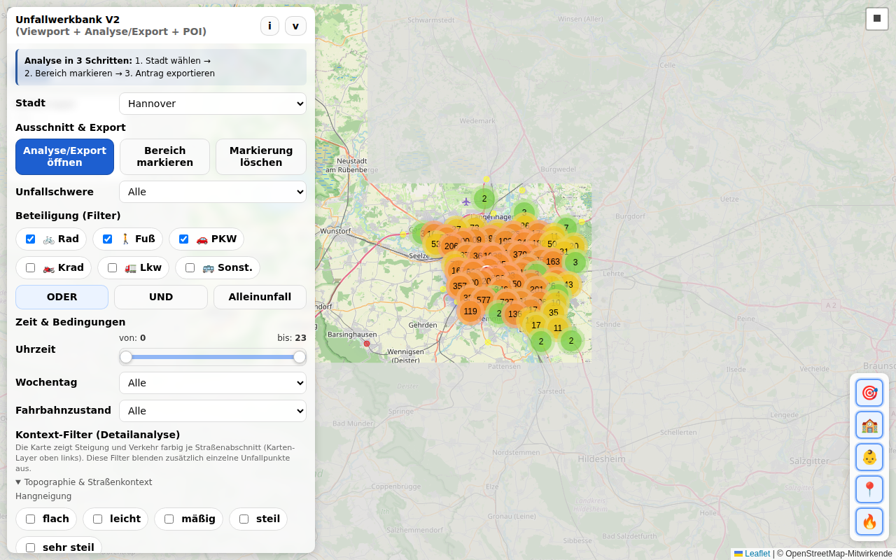](https://carstenartur.github.io/Unfallatlas/werkbank_v2.html)

---

## Voraussetzungen

- Moderner Webbrowser (Chrome, Firefox oder Edge empfohlen)
- Für lokale Nutzung: Python 3 (`python3 -m http.server 8000`) oder ein anderer lokaler Webserver
- Internetverbindung (für Kartenkacheln und Unfallatlas-Daten)

---

## Schnellstart

```bash
# Repository klonen
git clone https://github.com/carstenartur/Unfallatlas.git
cd Unfallatlas

# Lokalen Webserver starten
python3 -m http.server 8000

# Anwendung im Browser öffnen
# http://localhost:8000/werkbank_v2.html
```

---

## Benutzeroberfläche

Nach dem Öffnen der Seite erscheint die Kartenansicht rechts und das Steuerungspanel links.

[](https://carstenartur.github.io/Unfallatlas/werkbank_v2.html)

| Bereich | Beschreibung |
|---|---|
| **Karte (rechts)** | Interaktive Leaflet-Karte mit Unfallpunkten |
| **Steuerungspanel (links)** | Filter, Anzeigemodi, Zeichnen und Export |

---

## Funktionen im Detail

### Stadtauswahl

Wähle im Dropdown **Stadt** eine Stadt aus. Die Unfalldaten werden automatisch vom
Unfallatlas geladen und auf der Karte angezeigt.

[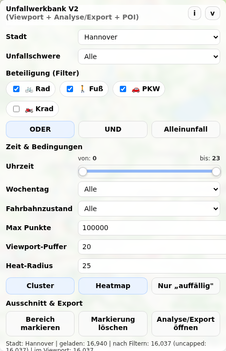](https://carstenartur.github.io/Unfallatlas/werkbank_v2.html)

---

### Unfallschwere filtern

Im Feld **Unfallschwere** kann nach Schweregrad gefiltert werden:

| Wert | Beschreibung |
|---|---|
| (alle) | Alle Schweregrade anzeigen |
| 1 | Getötete |
| 2 | Schwerverletzt |
| 3 | Leichtverletzt |

---

### Beteiligung filtern

Die Checkboxen unter **Beteiligung** schränken die Anzeige auf bestimmte Unfallbeteiligte ein:

- 🚲 **Rad** – Fahrradunfälle
- 🚶 **Fuß** – Fußgängerunfälle
- 🚗 **PKW** – Pkw-Unfälle
- 🏍️ **Krad** – Motorradunfälle

Die Verknüpfung mehrerer Filter wird über die **Modus-Buttons** gesteuert:

| Modus | Bedeutung | Beispiel |
|---|---|---|
| **ODER** | Mindestens eine der gewählten Beteiligungsarten | 🚲 ODER 🚗 → zeigt Unfälle, an denen Rad *oder* PKW beteiligt war |
| **UND** | Alle gewählten Beteiligungsarten gleichzeitig beteiligt | 🚲 UND 🚗 → zeigt nur Unfälle, an denen Rad *und* PKW beteiligt waren |
| **Alleinunfall** | Nur Alleinunfälle der gewählten Art | 🚲 Alleinunfall → Fahrradunfälle ohne andere Beteiligung |

[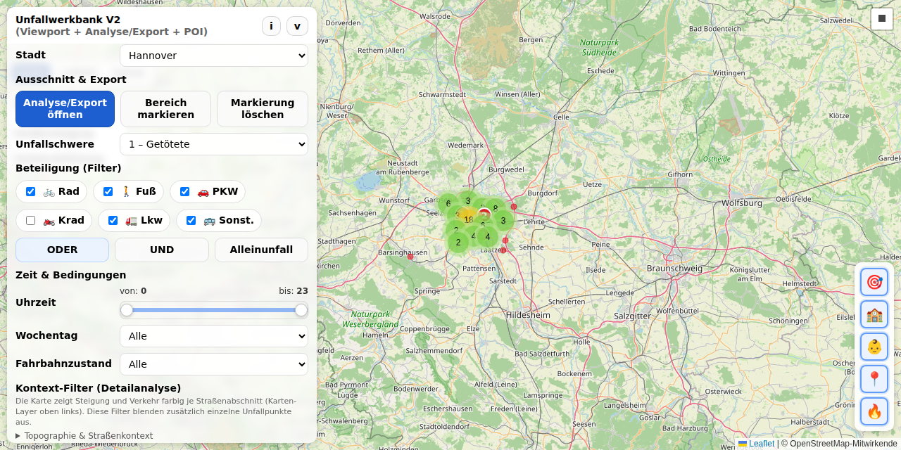](https://carstenartur.github.io/Unfallatlas/werkbank_v2.html?severity=1&includeCyclist=0&includePedestrian=1)

#### Filterkombinationen – Praxisbeispiele

Durch geschickte Kombination der Filter lassen sich gezielte Fragestellungen beantworten:

| Fragestellung | Einstellung | Screenshot |
|---|---|---|
| Wo kollidieren Autos mit Fahrrädern? | 🚲 + 🚗 im **UND**-Modus | [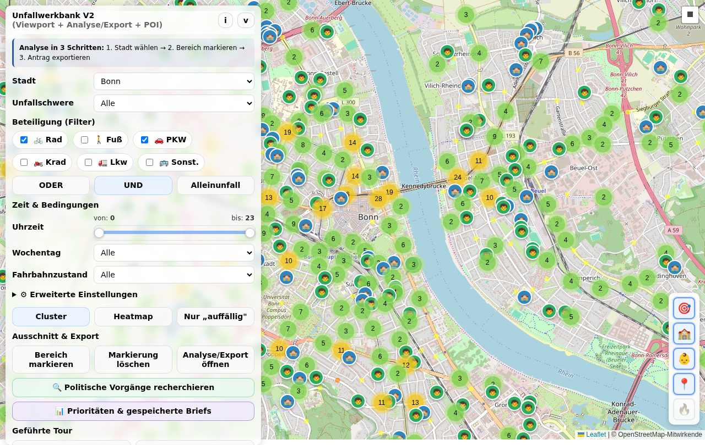](https://carstenartur.github.io/Unfallatlas/werkbank_v2.html?city=Bonn&includeCyclist=1&includePedestrian=0&includeCar=1&includeMotorcycle=0&involvementMode=and&showCluster=1&showHeatmap=0&showOnlyAboveAverage=0&severity=all&dayType=all&roadCondition=all&hourFrom=0&hourTo=23&centerLat=50.7350&centerLon=7.1000&zoom=14) |
| Wo stürzen Radfahrer ohne Fremdbeteiligung? | Nur 🚲 im **Alleinunfall**-Modus | [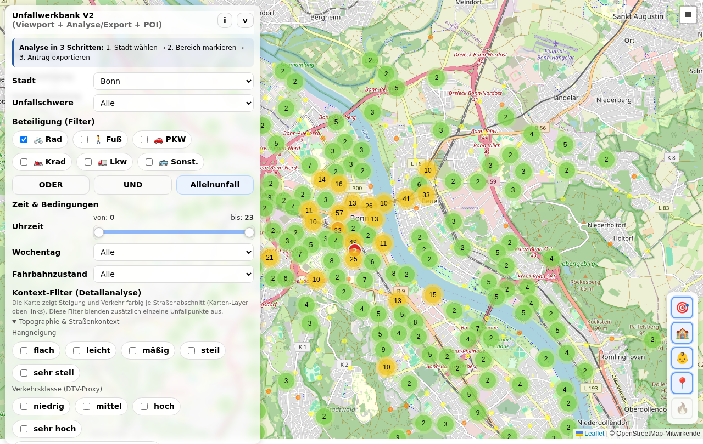](https://carstenartur.github.io/Unfallatlas/werkbank_v2.html?city=Bonn&includeCyclist=1&includePedestrian=0&includeCar=0&includeMotorcycle=0&involvementMode=solo&showCluster=1&showHeatmap=0&showOnlyAboveAverage=0&severity=all&dayType=all&roadCondition=all&hourFrom=0&hourTo=23&centerLat=50.7350&centerLon=7.1000&zoom=13) |
| Wo sind Fußgänger und Radfahrer gefährdet? | 🚲 + 🚶 im **ODER**-Modus | Standard-Ansicht mit beiden Checkboxen |

**Auto+Fahrrad-Unfälle (UND-Modus)** zeigen Stellen, an denen es regelmäßig zu Kollisionen zwischen Pkw und Rad kommt – ein typischer Hinweis auf fehlende oder unzureichende Radinfrastruktur.

**Fahrrad-Alleinunfälle** deuten häufig auf schlechte Fahrbahnoberfläche, gefährliche Bordsteinkanten oder unübersichtliche Radwegführung hin. Diese Unfälle werden oft übersehen, weil kein Unfallgegner beteiligt ist.

---

### Zeitfilter

Mit den **Stundenbereich-Slidern** kann der Anzeigezeitraum auf bestimmte Tagesstunden
eingeschränkt werden (z. B. 6–18 Uhr für den Berufsverkehr).

[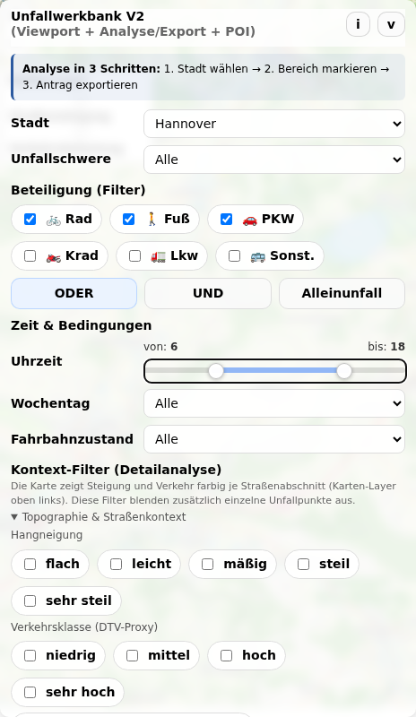](https://carstenartur.github.io/Unfallatlas/werkbank_v2.html?hourFrom=6&hourTo=18)

#### Wochentag

| Wert | Beschreibung |
|---|---|
| Alle | Keine Einschränkung (Standard) |
| Nur Wochenende (Sa/So) | Nur Unfälle an Samstagen und Sonntagen |
| Nur Werktag (Mo–Fr) | Nur Unfälle an Werktagen |

#### Fahrbahnzustand

| Wert | Beschreibung |
|---|---|
| Alle | Keine Einschränkung (Standard) |
| Trocken | Nur Unfälle bei trockener Fahrbahn |
| Nass/feucht | Nur Unfälle bei nasser oder feuchter Fahrbahn |
| Winterglatt | Nur Unfälle bei Winterglätte (Eis, Schnee) |
| Unbekannt | Fahrbahnzustand nicht erfasst |

---

### Erweiterte Darstellungsoptionen

Das Steuerungspanel enthält zusätzliche Parameter, die das Verhalten und die
Darstellung der Karte beeinflussen:

| Parameter | Beschreibung | Wertebereich | Standard |
|---|---|---|---|
| **Max Punkte** | Maximale Anzahl der angezeigten Unfallpunkte. Begrenzt die Datenmenge für bessere Performance. | 500–200 000 | 100 000 |
| **Viewport-Puffer** | Zusätzlicher Puffer (in %) um den sichtbaren Kartenausschnitt. Punkte im Pufferbereich werden mitgeladen, damit beim Scrollen weniger Nachladen nötig ist. | 0–100 % | 20 % |
| **Heat-Radius** | Radius (in Pixel) für die Heatmap-Darstellung. Größere Werte erzeugen weichere, ausgedehntere Wärmebereiche. | 5–60 | 25 |

---

### Cluster-Ansicht

In der Standard-**Cluster-Ansicht** werden Unfälle als farbige Kreise zusammengefasst.
Ein Klick auf einen Cluster vergrößert die Ansicht und zeigt Einzelpunkte.

[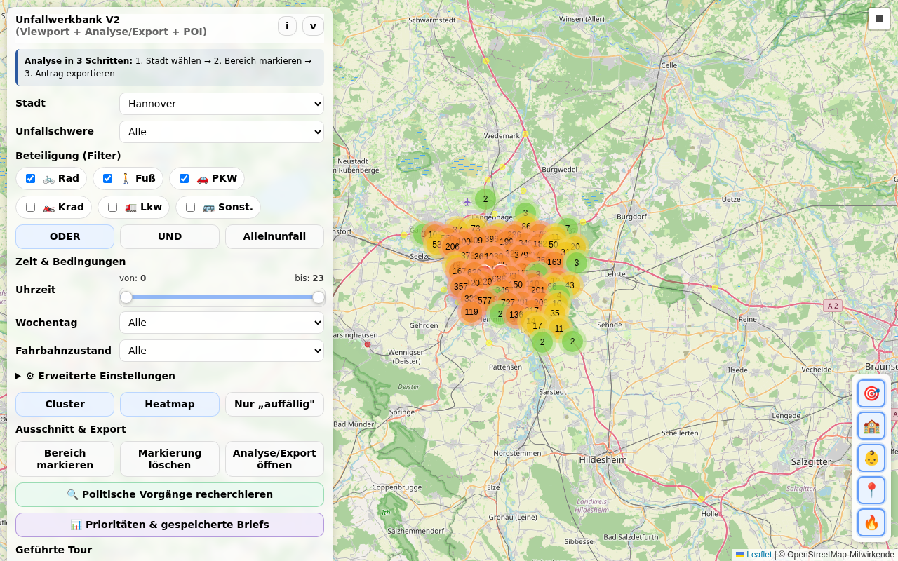](https://carstenartur.github.io/Unfallatlas/werkbank_v2.html)

---

### Heatmap-Ansicht

Über den Button **Heatmap** wird die Darstellung auf eine Dichteverteilung umgeschaltet.
Rot eingefärbte Bereiche entsprechen Unfallschwerpunkten.

[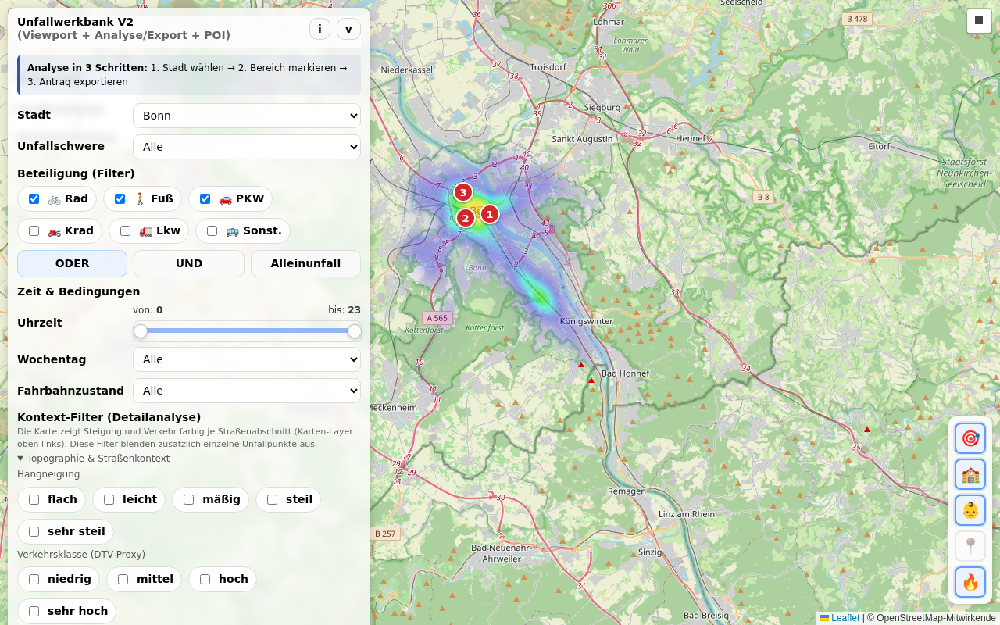](https://carstenartur.github.io/Unfallatlas/werkbank_v2.html?showHeatmap=1&showCluster=0)

---

### Nur „auffällig" (Hotspot-Filter)

Der Button **Nur „auffällig"** blendet nur solche Unfälle ein, die zu *überrepräsentierten*
Beteiligungskombinationen gehören. Die Werkbank unterteilt den Kartenausschnitt in ein
Raster und vergleicht die Unfallverteilung in jeder Zelle mit dem Stadtdurchschnitt.
Nur Zellen, deren Unfallanteil den Durchschnitt übersteigt, werden angezeigt.

Dieser Modus eignet sich besonders, um Hotspots zu identifizieren, an denen bestimmte
Unfallmuster gehäuft auftreten.

> **Tipp:** Der Hotspot-Filter arbeitet am besten in Kombination mit spezifischen
> Beteiligungsfiltern (z. B. Rad+PKW im UND-Modus) und einem konkreten Zeitfenster.

---

### Legende

Ein Klick auf **Legende** (i-Button) öffnet eine Erklärung der verwendeten Farben und Symbole.

[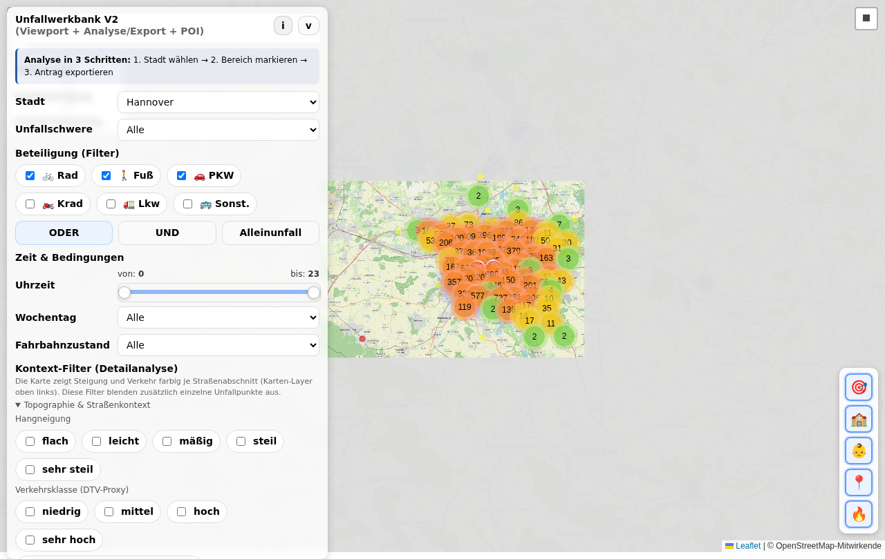](https://carstenartur.github.io/Unfallatlas/werkbank_v2.html)

---

### Bereich markieren (Zeichnen)

Mit **Bereich markieren** kann ein Rechteck auf der Karte gezeichnet werden. Die Auswertung
und der Export beziehen sich dann nur auf die Unfälle innerhalb dieses Bereichs.
**Markierung löschen** entfernt das Rechteck wieder.

Der markierte Bereich wird auch in der URL gespeichert (Parameter `selSouth`, `selWest`,
`selNorth`, `selEast`), sodass die exakte Auswahl per Link geteilt werden kann.

[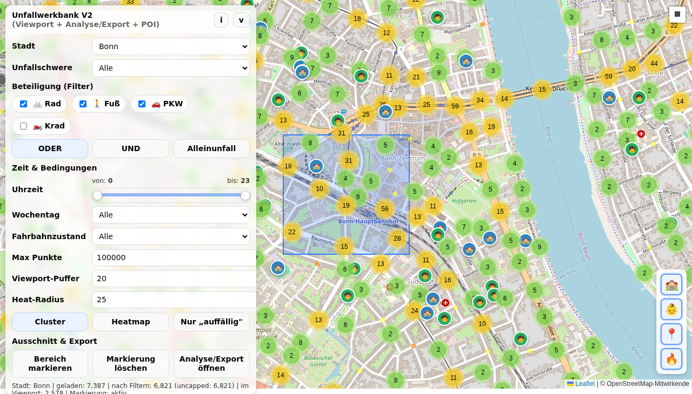](https://carstenartur.github.io/Unfallatlas/werkbank_v2.html?city=Bonn&includeCyclist=1&includePedestrian=1&includeCar=1&includeMotorcycle=0&involvementMode=or&showCluster=1&showHeatmap=0&showOnlyAboveAverage=0&severity=all&dayType=all&roadCondition=all&hourFrom=0&hourTo=23&centerLat=50.7330&centerLon=7.0950&zoom=15&selSouth=50.7300&selWest=7.0900&selNorth=50.7360&selEast=7.1000)

> **Tipp:** Ohne markierten Bereich bezieht sich der Export auf den aktuell sichtbaren
> Kartenausschnitt (Viewport). Für gezielte Analysen empfiehlt es sich, immer einen Bereich
> zu markieren.

---

### POI-Ansicht: Schulen und Kindergärten

Ab **Zoomstufe 15** werden automatisch **Schulen** 🏫 und **Kindergärten/Kitas** 🧒 als
Symbole auf der Karte eingeblendet. Diese Informationen stammen aus OpenStreetMap und werden
pro Stadt als GeoJSON bereitgestellt.

[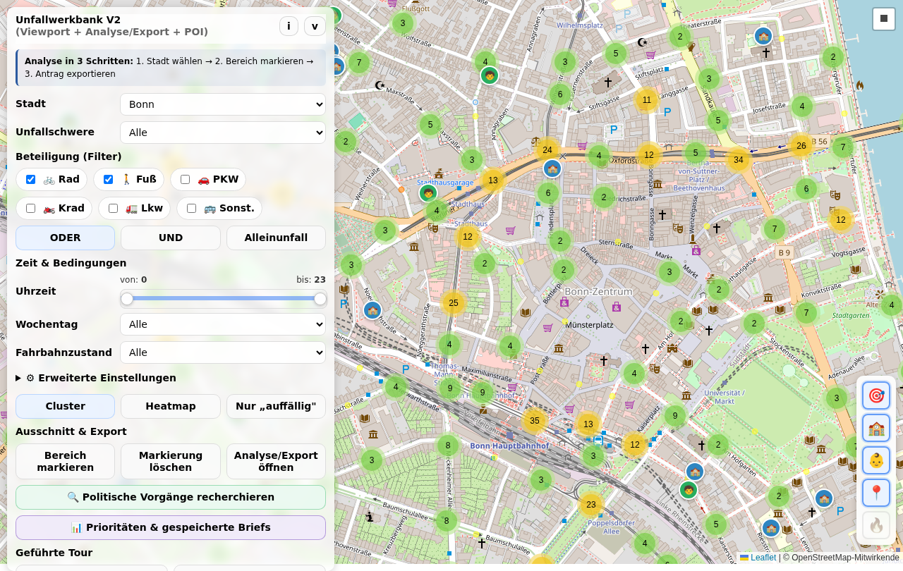](https://carstenartur.github.io/Unfallatlas/werkbank_v2.html?city=Bonn&includeCyclist=1&includePedestrian=1&includeCar=0&includeMotorcycle=0&involvementMode=or&showCluster=1&showHeatmap=0&showOnlyAboveAverage=0&severity=all&dayType=all&roadCondition=all&hourFrom=0&hourTo=23&centerLat=50.7350&centerLon=7.0950&zoom=16)

**Warum werden Schulen und Kitas angezeigt?**

Unfälle in der Nähe von Bildungseinrichtungen haben eine besondere Relevanz:

- **Kinder und Jugendliche** sind als Verkehrsteilnehmer besonders gefährdet
- **Schulwege** erfordern erhöhte Sicherheitsmaßnahmen
- In **Bezirksratsanträgen** verstärkt die Nähe zu sensiblen Einrichtungen die
  Dringlichkeit einer Maßnahme

Die Export-Funktion analysiert automatisch, wie viele Schulen und Kitas im markierten Bereich
und in einem Umkreis von 200 m liegen. Diese Information fließt als Abschnitt
**„Sensible Einrichtungen"** in den Export ein.

---

### Export und Bezirksratsantrag

Ein Klick auf **Analyse/Export öffnen** öffnet das Export-Modal.

[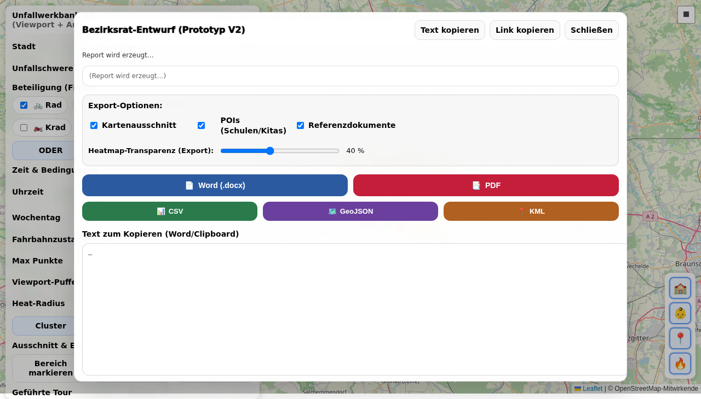](https://carstenartur.github.io/Unfallatlas/werkbank_v2.html?export=1)

#### Warum ein Bezirksratsantrag?

Die Werkbank generiert einen **Entwurf für einen Bezirksratsantrag**. In vielen deutschen
Kommunen ist der Bezirksrat (oder Ortsrat / Stadtteilbeirat) das Gremium, das konkret
Verkehrssicherheitsmaßnahmen in einem Stadtteil beantragen kann. Ein typischer Antrag
enthält:

1. **Sachverhalt** – Beschreibung des Problems mit Daten
2. **Beschlussvorschlag** – Was die Verwaltung tun soll
3. **Datenquelle** – Nachweis, dass die Analyse auf amtlichen Daten basiert

Die Werkbank erstellt diesen Text automatisch auf Basis der aktuell eingestellten Filter
und des markierten Bereichs. Der Antrag ist als **Entwurf** gedacht und soll vor dem
Einreichen von der antragstellenden Person überarbeitet und ergänzt werden.

#### Zusammenhang zwischen Filtern und Export

Der Export-Text spiegelt die aktuellen Einstellungen wider:

| Einstellung | Wirkung im Export |
|---|---|
| **Stadt** | Name der Stadt im Betreff und Sachverhalt |
| **Unfallschwere** | Statistik zu Getöteten / Schwer- / Leichtverletzten im Bereich |
| **Beteiligung + Modus** | Analyse der Beteiligungskombinationen: welche Kombinationen (z. B. Rad+PKW) sind im markierten Bereich *überrepräsentiert* verglichen mit dem Stadtdurchschnitt |
| **Zeitfilter** | Nur Unfälle im gewählten Stundenbereich fließen in die Statistik ein |
| **Fahrbahnzustand** | Nur Unfälle bei gewähltem Zustand werden ausgewertet |
| **Markierter Bereich** | Vergleich: Unfälle im Bereich vs. gleiche Filter stadtweit |
| **POIs (Schulen/Kitas)** | Abschnitt „Sensible Einrichtungen" – Anzahl der Schulen/Kitas im Bereich und im 200-m-Umkreis |
| **Referenzdokumente** | Abschnitt mit Bezugsdokumenten (wenn Checkbox aktiv) |

[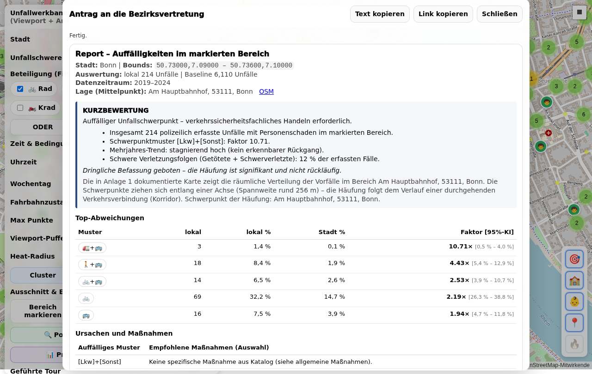](https://carstenartur.github.io/Unfallatlas/werkbank_v2.html?city=Bonn&includeCyclist=1&includePedestrian=0&includeCar=1&includeMotorcycle=0&involvementMode=and&showCluster=1&showHeatmap=0&showOnlyAboveAverage=0&severity=all&dayType=all&roadCondition=all&hourFrom=6&hourTo=18&centerLat=50.7330&centerLon=7.0950&zoom=15&selSouth=50.7300&selWest=7.0900&selNorth=50.7360&selEast=7.1000&export=1)

#### Export-Optionen

| Option | Beschreibung |
|---|---|
| **Kartenausschnitt** | Kartenbild in den Export aufnehmen |
| **POIs (Schulen/Kitas)** | Analyse sensibler Einrichtungen im Bereich einbeziehen |
| **Referenzdokumente** | Verweise auf Quellen und Bezugsdokumente |
| **Als Word exportieren** | `.docx`-Datei herunterladen |
| **Als PDF exportieren** | PDF-Datei herunterladen |
| **Text kopieren** | Berichtstext in die Zwischenablage kopieren |
| **Link kopieren** | Direkt-Link zur aktuellen Ansicht kopieren |

Der generierte **Link** enthält alle Filtereinstellungen und den markierten Bereich als
URL-Parameter. So kann die exakte Analyse jederzeit reproduziert und an andere Personen
weitergegeben werden.

---

## Praxisbeispiele: Unfallanalyse in Bonn

Die folgenden Beispiele zeigen typische Analysen in Bonn. Die Links öffnen die Werkbank
mit den voreingestellten Filtern und dem passenden Kartenausschnitt.

> **Hinweis:** Die Links öffnen die Werkbank direkt auf GitHub Pages.

### Beispiel 1: Auto-Fahrrad-Kollisionen am Hauptbahnhof Bonn

Der Bereich rund um den Bonner Hauptbahnhof ist ein Knotenpunkt mit starkem Mischverkehr.
Hier kreuzen sich Rad- und Autoverkehr an mehreren Stellen.

**Filter:** 🚲 Rad + 🚗 PKW im **UND**-Modus, Heatmap aktiv, Bereich markiert

[→ Werkbank öffnen](https://carstenartur.github.io/Unfallatlas/werkbank_v2.html?city=Bonn&includeCyclist=1&includePedestrian=0&includeCar=1&includeMotorcycle=0&involvementMode=and&showCluster=0&showHeatmap=1&showOnlyAboveAverage=0&severity=all&dayType=all&roadCondition=all&hourFrom=0&hourTo=23&centerLat=50.7326&centerLon=7.0963&zoom=16&selSouth=50.7300&selWest=7.0910&selNorth=50.7355&selEast=7.1010)

[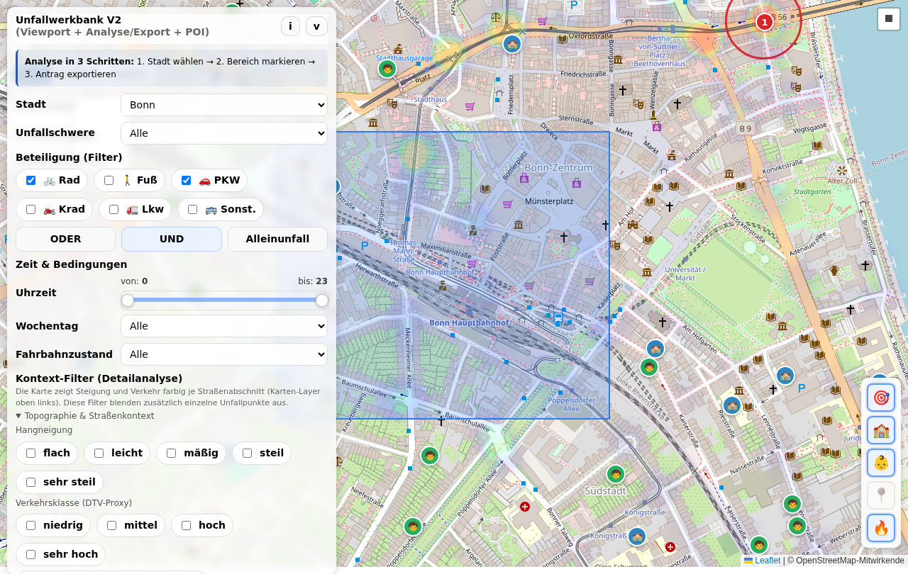](https://carstenartur.github.io/Unfallatlas/werkbank_v2.html?city=Bonn&includeCyclist=1&includePedestrian=0&includeCar=1&includeMotorcycle=0&involvementMode=and&showCluster=0&showHeatmap=1&showOnlyAboveAverage=0&severity=all&dayType=all&roadCondition=all&hourFrom=0&hourTo=23&centerLat=50.7326&centerLon=7.0963&zoom=16&selSouth=50.7300&selWest=7.0910&selNorth=50.7355&selEast=7.1010)

**Einordnung:** Die Heatmap zeigt Häufungen von Rad-PKW-Kollisionen in unmittelbarer
Nähe des Bahnhofs. Solche Stellen sind typische Kandidaten für bauliche Maßnahmen wie
geschützte Radstreifen oder Abbiegeassistenzsysteme. Im Export-Text würde die Werkbank
automatisch berechnen, ob die Quote der Rad+PKW-Unfälle hier höher ist als im
Bonner Stadtdurchschnitt.

---

### Beispiel 2: Fahrrad-Alleinunfälle in Bonn

Alleinunfälle werden in der Verkehrsplanung oft unterschätzt, deuten aber auf
infrastrukturelle Mängel hin (schlechter Belag, Bordsteinkanten, Gleise).

**Filter:** Nur 🚲 Rad im **Alleinunfall**-Modus

[→ Werkbank öffnen](https://carstenartur.github.io/Unfallatlas/werkbank_v2.html?city=Bonn&includeCyclist=1&includePedestrian=0&includeCar=0&includeMotorcycle=0&involvementMode=solo&showCluster=1&showHeatmap=0&showOnlyAboveAverage=0&severity=all&dayType=all&roadCondition=all&hourFrom=0&hourTo=23&centerLat=50.7350&centerLon=7.1000&zoom=13)

[](https://carstenartur.github.io/Unfallatlas/werkbank_v2.html?city=Bonn&includeCyclist=1&includePedestrian=0&includeCar=0&includeMotorcycle=0&involvementMode=solo&showCluster=1&showHeatmap=0&showOnlyAboveAverage=0&severity=all&dayType=all&roadCondition=all&hourFrom=0&hourTo=23&centerLat=50.7350&centerLon=7.1000&zoom=13)

**Einordnung:** Die Cluster zeigen, wo Radfahrer ohne Fremdbeteiligung verunfallen.
Häufungen können auf problematische Streckenabschnitte hinweisen. Durch Kombination
mit dem Fahrbahnzustand-Filter (z. B. „Nass/feucht") lassen sich wetterbedingte
Sturzstellen identifizieren.

---

### Beispiel 3: Unfälle in der Nähe von Schulen (Rad+Fuß, Berufsverkehr)

Unfälle im Umfeld von Schulen sind besonders besorgniserregend. Die POI-Anzeige
macht sichtbar, welche Einrichtungen betroffen sind.

**Filter:** 🚲 Rad + 🚶 Fuß im **ODER**-Modus, Uhrzeit 6–18 Uhr (Schulzeiten), Zoom 16

[→ Werkbank öffnen](https://carstenartur.github.io/Unfallatlas/werkbank_v2.html?city=Bonn&includeCyclist=1&includePedestrian=1&includeCar=0&includeMotorcycle=0&involvementMode=or&showCluster=1&showHeatmap=0&showOnlyAboveAverage=0&severity=all&dayType=all&roadCondition=all&hourFrom=6&hourTo=18&centerLat=50.7350&centerLon=7.0950&zoom=16)

[](https://carstenartur.github.io/Unfallatlas/werkbank_v2.html?city=Bonn&includeCyclist=1&includePedestrian=1&includeCar=0&includeMotorcycle=0&involvementMode=or&showCluster=1&showHeatmap=0&showOnlyAboveAverage=0&severity=all&dayType=all&roadCondition=all&hourFrom=0&hourTo=23&centerLat=50.7350&centerLon=7.0950&zoom=16)

**Einordnung:** Ab Zoomstufe 15 werden Schulen 🏫 und Kitas 🧒 eingeblendet. So wird
sofort sichtbar, ob Unfallhäufungen im direkten Umfeld von Bildungseinrichtungen liegen.
Dies ist ein starkes Argument in Bezirksratsanträgen, da die Sicherheit von Kindern
auf dem Schulweg politisch höchste Priorität hat.

---

### Beispiel 4: Kompletter Workflow – vom Filter zum Bezirksratsantrag

Dieses Beispiel zeigt den typischen Ablauf von der Analyse bis zum fertigen Antrag:

1. **Stadt wählen:** Bonn auswählen
2. **Filter setzen:** 🚲 Rad + 🚗 PKW, UND-Modus, Uhrzeit 6–18 Uhr (Berufsverkehr)
3. **Bereich markieren:** Rechteck um den Bereich rund um den Hauptbahnhof zeichnen
4. **Analysieren:** Die Cluster/Heatmap zeigt Häufungen. POIs (Schulen/Kitas) werden sichtbar.
5. **Export öffnen:** Klick auf „Analyse/Export öffnen"

[→ Workflow nachspielen](https://carstenartur.github.io/Unfallatlas/werkbank_v2.html?city=Bonn&includeCyclist=1&includePedestrian=0&includeCar=1&includeMotorcycle=0&involvementMode=and&showCluster=1&showHeatmap=0&showOnlyAboveAverage=0&severity=all&dayType=all&roadCondition=all&hourFrom=6&hourTo=18&centerLat=50.7330&centerLon=7.0950&zoom=15&selSouth=50.7300&selWest=7.0900&selNorth=50.7360&selEast=7.1000)

[](https://carstenartur.github.io/Unfallatlas/werkbank_v2.html?city=Bonn&includeCyclist=1&includePedestrian=0&includeCar=1&includeMotorcycle=0&involvementMode=and&showCluster=1&showHeatmap=0&showOnlyAboveAverage=0&severity=all&dayType=all&roadCondition=all&hourFrom=6&hourTo=18&centerLat=50.7330&centerLon=7.0950&zoom=15&selSouth=50.7300&selWest=7.0900&selNorth=50.7360&selEast=7.1000&export=1)

**Was passiert im Export:**

- Die Werkbank vergleicht die Unfälle **im markierten Bereich** mit dem **Bonner Stadtdurchschnitt** (bei gleichen Filtern für Schwere, Tageszeit und Fahrbahnzustand)
- Sie berechnet, welche **Beteiligungskombinationen überrepräsentiert** sind (z. B. „Rad+PKW-Unfälle sind hier 2,3× häufiger als im Stadtdurchschnitt")
- Sie listet **Schulen und Kitas** im Bereich und im 200-m-Umkreis auf
- Sie generiert einen **Bezirksratsantrag-Entwurf** mit Sachverhalt, Beschlussvorschlag und Datenquelle
- Der Export enthält einen **Link**, der die exakt gleiche Ansicht reproduziert

> **Wichtig:** Der Export-Text ist ein Entwurf. Vor dem Einreichen sollte er an die
> lokalen Gegebenheiten angepasst und mit eigenen Beobachtungen ergänzt werden.

---

## CLI-Skripte (Kurzreferenz)

| Skript | Plattform | Beschreibung |
|---|---|---|
| `convertAmt2gmaps.sh` | Linux / macOS | Unfallatlas-Daten herunterladen und in CSV/GeoJSON/KML konvertieren |
| `convertAmt2gmaps.ps1` | Windows (PowerShell) | Gleiche Funktion für Windows |

Ausführliche Informationen zu Parametern und Nutzung: → [README.md](../README.md)

---

## Datenquelle & Lizenz

Die Unfalldaten stammen aus dem
[Unfallatlas des Statistikportals der deutschen Bundesländer](https://unfallatlas.statistikportal.de/).

Die Daten stehen unter der
**[Datenlizenz Deutschland – Namensnennung – Version 2.0](https://www.govdata.de/dl-de/by-2-0)**
(`dl-de/by-2-0`) zur Verfügung.

---

## Technische Details

| Komponente | Technologie |
|---|---|
| Kartenanzeige | [Leaflet.js](https://leafletjs.com/) |
| Cluster-Ansicht | [Leaflet.markercluster](https://github.com/Leaflet/Leaflet.markercluster) |
| Heatmap | [Leaflet.heat](https://github.com/Leaflet/Leaflet.heat) |
| Zeichenwerkzeug | [Leaflet.draw](https://github.com/Leaflet/Leaflet.draw) |
| PDF-Export | [pdfMake](https://pdfmake.github.io/docs/) |
| Word-Export | [docx.js](https://docx.js.org/) |
| Tests | [Playwright](https://playwright.dev/) + [Jest](https://jestjs.io/) |
| CI/CD | GitHub Actions |

---

## Stadtauswahl und `cities.txt`

Die Liste der im Dropdown verfügbaren Städte wird aus der Datei **`cities.txt`** im
Repository-Stammverzeichnis geladen. Jede Zeile enthält einen Stadtnamen (Kommentare mit
`#` und Leerzeilen werden ignoriert).

Aktuelle Städte:

```
Hannover
Bonn
Berlin
Hamburg
Muenchen
Koeln
Frankfurt am Main
Bielefeld
Heilbronn
```

### Eine neue Stadt hinzufügen

1. **Stadtnamen in `cities.txt` eintragen** – eine Zeile pro Stadt.
2. **Unfalldaten generieren** – das Konverterskript laden und konvertieren:
   ```bash
   ./convertAmt2gmaps.sh --city "Dortmund" --limit 0 --rad "" --pkw "" --fuss "" --krad ""
   ```
   Dies erzeugt `out/output_all_years_dortmund.geojson` (und `.csv`).
3. **POI-Daten erzeugen** (optional, für Schulen/Kitas auf der Karte):
   ```bash
   ./fetch_poi_osm.sh "Dortmund"
   ```
   Dies erzeugt `out/poi_dortmund.geojson`.
4. **Dateien committen und pushen** – damit die Daten auf GitHub Pages verfügbar sind.

> **Hinweis:** Die Stadtnamen müssen exakt mit den Bezeichnungen im Unfallatlas
> übereinstimmen. Das Konverterskript verwendet eine fest codierte `CITY_MAP`, um
> Stadtnamen auf Gemeindeschlüssel (AGS) abzubilden, und bricht mit einer Fehlermeldung
> ab, wenn die Stadt dort nicht hinterlegt ist. Für nicht gelistete Städte muss entweder
> die `CITY_MAP` im Skript ergänzt oder der AGS explizit mit `--ags <Gemeindeschlüssel>`
> angegeben werden. Umlaute werden in Dateinamen normalisiert (z. B. „München" → `muenchen`).

### Stadtspezifische Daten

Für jede Stadt `<name>` werden folgende Dateien unter `out/` erwartet:

| Datei | Inhalt |
|---|---|
| `output_all_years_<name>.geojson` | Alle Unfallorte aller verfügbaren Jahre |
| `output_all_years_<name>.csv` | Gleiche Daten als CSV |
| `poi_<name>.geojson` | Schulen und Kindergärten (OpenStreetMap) |

---

## Daten aktualisieren – neue Unfallatlas-Jahrgänge

Der [Unfallatlas](https://unfallatlas.statistikportal.de/) wird in der Regel **einmal
jährlich** aktualisiert, typischerweise im Sommer/Herbst für das Vorjahr (z. B. erscheinen
die Daten für 2024 voraussichtlich Mitte 2025).

### Ablauf zur Aktualisierung

1. **Prüfen**, ob neue Daten verfügbar sind: Die ZIP-Dateien werden von
   `https://www.opengeodata.nrw.de/produkte/transport_verkehr/unfallatlas/` bereitgestellt.
   Das Konverterskript verwendet standardmäßig eine feste Jahresliste (aktuell 2016–2024).
   Für neue Jahrgänge muss die Liste im Skript angepasst oder der Parameter `--years`
   verwendet werden (z. B. `--years "2016 2017 ... 2025"`).
2. **Konverterskript ausführen** – für alle Städte in `cities.txt`:
   ```bash
   # Alle Städte aus cities.txt auf einmal:
   ./convertAmt2gmaps.sh --limit 0 --rad "" --pkw "" --fuss "" --krad "" \
     --city "Hannover" --city "Bonn" --city "Berlin" ...
   ```
   Oder den GitHub Actions Workflow verwenden (siehe unten).
3. **Ergebnisse committen und pushen**.

> **Tipp:** Das Skript überspringt bereits heruntergeladene ZIP-Dateien automatisch
> (Caching). Nur neue Jahrgänge werden heruntergeladen.

---

## GitHub Actions Workflows

Das Repository enthält vier automatisierte Workflows:

### `generate-and-commit.yml` – Unfalldaten generieren

- **Auslösung:** Manuell (`workflow_dispatch`)
- **Funktion:** Führt `convertAmt2gmaps.sh` für alle Städte aus `cities.txt` aus,
  validiert die erzeugten GeoJSON-Dateien und committet die Ergebnisse automatisch.
- **Verwendung:** Auf GitHub → Actions → „Generate & Commit" → „Run workflow"
- **Wann nötig:** Nach Hinzufügen einer neuen Stadt in `cities.txt` oder wenn neue
  Unfallatlas-Jahrgänge veröffentlicht werden.

### `fetchpoi.yml` – POI-Daten (Schulen/Kitas) erzeugen

- **Auslösung:** Manuell (`workflow_dispatch`)
- **Funktion:** Führt `fetch_poi_osm.sh` für jede Stadt in `cities.txt` aus (überspringt
  bereits vorhandene). Lädt Schul- und Kita-Standorte von OpenStreetMap via Overpass API.
  Validiert und committet die Ergebnisse.
- **Verwendung:** Auf GitHub → Actions → „Fetch POIs for cities.txt" → „Run workflow"
- **Wann nötig:** Nach Hinzufügen einer neuen Stadt oder bei gewünschter Aktualisierung
  der POI-Daten.

### `test.yml` – Automatische Tests

- **Auslösung:** Bei jedem Push und Pull Request auf `main` oder `develop`
- **Funktion:** Führt Unit-, Integrations-, Performance- und E2E-Tests (Playwright) aus.
  Erstellt dabei auch die Dokumentations-Screenshots.

### `checkjson.yml` – GeoJSON-Validierung

- **Auslösung:** Bei Änderungen an `out/**/*.geojson` oder manuell
- **Funktion:** Prüft alle GeoJSON-Dateien auf syntaktische Korrektheit und gibt
  Statistiken aus (Feature-Anzahl, Jahre, Kategorien, Bounding Box).

---

## URL-Parameter (Referenz)

Alle Filtereinstellungen und die Kartenposition werden in der URL gespeichert. Dadurch
lassen sich Analysen als Link teilen und reproduzieren. Die folgende Tabelle listet alle
unterstützten Parameter auf:

### Filter

| Parameter | Beschreibung | Werte | Standard |
|---|---|---|---|
| `city` | Stadt | Stadtname (z. B. `Bonn`) | `Hannover` |
| `severity` | Unfallschwere | `all`, `1` (Getötete), `2` (Schwerverletzte), `3` (Leichtverletzte) | `all` |
| `includeCyclist` | Fahrrad-Filter | `0` / `1` | `1` |
| `includePedestrian` | Fußgänger-Filter | `0` / `1` | `1` |
| `includeCar` | PKW-Filter | `0` / `1` | `1` |
| `includeMotorcycle` | Krad-Filter | `0` / `1` | `0` |
| `involvementMode` | Verknüpfungsmodus | `or`, `and`, `solo` | `or` |
| `hourFrom` | Stundenfilter von | `0`–`23` | `0` |
| `hourTo` | Stundenfilter bis | `0`–`23` | `23` |
| `dayType` | Wochentag | `all`, `weekend`, `weekday` | `all` |
| `roadCondition` | Fahrbahnzustand | `all`, `dry`, `wet`, `icy`, `__unknown__` | `all` |

### Darstellung

| Parameter | Beschreibung | Werte | Standard |
|---|---|---|---|
| `showCluster` | Cluster-Ansicht | `0` / `1` | `1` |
| `showHeatmap` | Heatmap-Ansicht | `0` / `1` | `1` |
| `showOnlyAboveAverage` | Nur „auffällig" | `0` / `1` | `0` |
| `maxPoints` | Max. angezeigte Punkte | `500`–`200000` | `100000` |
| `viewportPaddingPct` | Viewport-Puffer (%) | `0`–`100` | `20` |
| `heatRadius` | Heatmap-Radius (px) | `5`–`60` | `25` |

### Kartenposition

| Parameter | Beschreibung | Werte | Standard |
|---|---|---|---|
| `centerLat` | Breitengrad Kartenmitte | Dezimalzahl | (automatisch) |
| `centerLon` | Längengrad Kartenmitte | Dezimalzahl | (automatisch) |
| `zoom` | Zoomstufe | `1`–`19` | (automatisch) |

### Auswahlbereich

| Parameter | Beschreibung | Werte | Standard |
|---|---|---|---|
| `selSouth` | Südgrenze des markierten Bereichs | Dezimalzahl | (kein Bereich) |
| `selWest` | Westgrenze | Dezimalzahl | (kein Bereich) |
| `selNorth` | Nordgrenze | Dezimalzahl | (kein Bereich) |
| `selEast` | Ostgrenze | Dezimalzahl | (kein Bereich) |

### Sonstiges

| Parameter | Beschreibung | Werte | Standard |
|---|---|---|---|
| `export` | Export-Modal beim Laden öffnen | `0` / `1` | `0` |

**Beispiel-URL:**
```
werkbank_v2.html?city=Bonn&includeCyclist=1&includeCar=1&involvementMode=and&showHeatmap=1&showCluster=0&hourFrom=6&hourTo=18&zoom=15&centerLat=50.7330&centerLon=7.0950
```

---

## Häufige Fragen (FAQ)

### Wie kann ich eine bestimmte Analyse mit anderen teilen?

Alle Filtereinstellungen, die Kartenposition und ein markierter Bereich werden automatisch in der URL gespeichert. Einfach die aktuelle Browser-URL kopieren (oder „Link kopieren" im Export-Modal) und weitergeben. Jeder, der den Link öffnet, sieht exakt die gleiche Ansicht.

### Woher stammen die Daten?

Die Unfalldaten stammen aus dem [Unfallatlas](https://unfallatlas.statistikportal.de/) der Statistischen Ämter des Bundes und der Länder. Sie werden jährlich aktualisiert und stehen unter der [Datenlizenz Deutschland – Namensnennung – Version 2.0](https://www.govdata.de/dl-de/by-2-0) als Open Data zur Verfügung.

### Warum fehlt meine Stadt?

Die Werkbank unterstützt aktuell die Städte aus `cities.txt` (derzeit u. a. Hannover, Bonn, Berlin, Hamburg, München, Köln, Frankfurt am Main). Neue Städte können hinzugefügt werden – siehe Abschnitt [Stadtauswahl und cities.txt](#stadtauswahl-und-citiestxt).

### Kann ich den Export-Text direkt verwenden?

Der Export ist als **Entwurf** gedacht. Er enthält automatisch generierte Sachverhaltsdarstellungen und Beschlussvorschläge und sollte vor dem Einreichen von der antragstellenden Person überprüft, ergänzt und an die lokalen Gegebenheiten angepasst werden.

### Funktioniert die Werkbank auch offline?

Nach dem erstmaligen Laden der Seite und der Daten (GeoJSON) funktionieren Filter, Darstellung und Export auch offline. Lediglich die Kartenkacheln (OpenStreetMap) benötigen eine Internetverbindung.

---

## Methodik und Grenzen

### Datengrundlage

Die Werkbank verwendet ausschließlich Daten aus dem [Unfallatlas](https://unfallatlas.statistikportal.de/) – dem offiziellen Open-Data-Portal für polizeilich erfasste Straßenverkehrsunfälle mit Personenschaden in Deutschland. Die Daten umfassen die Jahre 2016–2024 und werden jährlich aktualisiert.

### Was erfasst wird – und was nicht

- **Erfasst** werden alle polizeilich aufgenommenen Verkehrsunfälle mit Personenschaden (Getötete, Schwer- und Leichtverletzte).
- **Nicht erfasst** werden: reine Sachschäden, Beinaheunfälle, nicht gemeldete Unfälle (Dunkelziffer), subjektives Unsicherheitsempfinden.
- Die **Dunkelziffer** ist gerade bei Fahrradunfällen ohne Fremdverschulden (Alleinunfälle) und bei leichten Verletzungen erheblich. Schätzungen gehen von einer Erfassungsquote von ca. 50 % bei Radunfällen aus.

### Genauigkeit der Ortsangaben

- Die Koordinaten werden aus der Unfallaufnahme der Polizei abgeleitet und weisen eine typische Genauigkeit von ±10–50 m auf.
- Vereinzelt können Unfälle leicht verschoben auf der Karte erscheinen (z. B. auf die nächstgelegene Straßenachse).

### Hotspot-Erkennung

- Die Funktion „Nur auffällig" vergleicht die lokale Unfallverteilung mit dem Stadtdurchschnitt. Sie zeigt Bereiche, in denen bestimmte Unfallmuster **überrepräsentiert** sind.
- Dies ist ein **statistischer Hinweis**, kein Beweis für eine kausale Ursache. Lokale Ortskenntnis ist für die Interpretation unverzichtbar.

### Einschränkungen des Exports

- Der Bezirksratsantrag wird automatisch generiert und basiert auf den eingestellten Filtern. Er ist ein **Entwurf** und ersetzt keine fachliche Bewertung durch eine Unfallkommission oder Verkehrsplanung.
- Die POI-Analyse (Schulen/Kitas) basiert auf OpenStreetMap-Daten und kann unvollständig sein.

### Empfehlung

Für fundierte Maßnahmenvorschläge sollte die Werkbank als **Erkenntniswerkzeug** genutzt werden – ergänzt durch Ortsbegehungen, Unfallkommissionsberichte und verkehrsplanerische Expertise.
