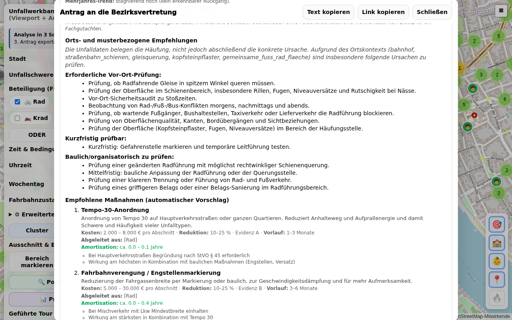

# Unfallwerkbank V2 – Dokumentation

## Inhaltsverzeichnis

- [Überblick](#überblick)
- [Voraussetzungen](#voraussetzungen)
- [Schnellstart](#schnellstart)
- [Benutzeroberfläche](#benutzeroberfläche)
- [Funktionen im Detail](#funktionen-im-detail)
  - [Stadtauswahl](#stadtauswahl)
  - [Unfallschwere filtern](#unfallschwere-filtern)
  - [Beteiligung filtern](#beteiligung-filtern)
  - [Zeitfilter](#zeitfilter)
  - [Erweiterte Darstellungsoptionen](#erweiterte-darstellungsoptionen)
  - [Cluster-Ansicht](#cluster-ansicht)
  - [Heatmap-Ansicht](#heatmap-ansicht)
  - [Nur „auffällig“ (Hotspot-Filter)](#nur-auffällig-hotspot-filter)
  - [Legende](#legende)
  - [Bereich markieren (Zeichnen)](#bereich-markieren-zeichnen)
  - [POI-Ansicht: Schulen und Kindergärten](#poi-ansicht-schulen-und-kindergärten)
  - [Export und Bezirksratsantrag](#export-und-bezirksratsantrag)
  - [Tour-System (Player + Recorder)](#tour-system-player--recorder)
  - [Showcase-Seite](#showcase-seite)
- [Praxisbeispiele: Unfallanalyse in Bonn](#praxisbeispiele-unfallanalyse-in-bonn)
- [CLI-Skripte (Kurzreferenz)](#cli-skripte-kurzreferenz)
- [Datenquelle & Lizenz](#datenquelle--lizenz)
- [Technische Details](#technische-details)
- [Stadtauswahl und cities.txt](#stadtauswahl-und-citiestxt)
- [Daten aktualisieren – neue Unfallatlas-Jahrgänge](#daten-aktualisieren--neue-unfallatlas-jahrgänge)
- [GitHub Actions Workflows](#github-actions-workflows)
- [URL-Parameter (Referenz)](#url-parameter-referenz)
- [Häufige Fragen (FAQ)](#häufige-fragen-faq)
- [Methodik und Grenzen](#methodik-und-grenzen)
- [Statistische Belastbarkeit](#statistische-belastbarkeit)
- [Volkswirtschaftliche Kosten](#volkswirtschaftliche-kosten)
- [Maßnahmenkatalog](#maßnahmenkatalog)
- [Verkehrszeit-Muster (Time Cluster)](#verkehrszeit-muster-time-cluster)
- [Mehrjahres-Trend](#mehrjahres-trend)
- [Stunden-Heatmap im Antrag](#stunden-heatmap-im-antrag)
- [Dunkelziffer-Pflichthinweis](#dunkelziffer-pflichthinweis)
- [OSM-Kontext-Anreicherung](#osm-kontext-anreicherung)
- [KI-Antragsentwurf (optional)](#ki-antragsentwurf-optional)

---

## Überblick

Die **Unfallwerkbank V2** ist eine interaktive Webanwendung zur Visualisierung und Analyse
von [Unfallatlas](https://unfallatlas.statistikportal.de/)-Daten (Open Data) für deutsche Städte.
Sie ermöglicht:

- **Filterung** nach Stadt, Unfallschwere, Beteiligungsart (Rad, Fuß, PKW, Krad, Lkw, Sonstig), Uhrzeit und Straßenzustand
- **Darstellung** der Unfälle als Cluster-Karte oder Heatmap
- **Bereich markieren** – gezieltes Auswählen eines Kartenausschnitts für die Auswertung
- **POI-Anzeige** – Schulen, Kindergärten und Kitas in der Nähe von Unfallschwerpunkten sichtbar machen
- **Export** als PDF, Word-Dokument, CSV, GeoJSON oder KML – z. B. als Vorlage für Bezirksratsanträge oder zur Weiterverarbeitung in GIS-Systemen

[](https://carstenartur.github.io/Unfallatlas/werkbank_v2.html)

### Demo-Ablauf

Der folgende Demo-Film zeigt den typischen Workflow: Stadt wählen → Filter setzen → Heatmap → Legende → Export.


> **Hinweis:** Das Video zeigt die UI vor Einführung der Kontextdaten;
> die aktuelle Oberfläche enthält zusätzlich die Sektion
> **Kontext (neu)** im Filter-Panel sowie einen Block **Kontextdaten**
> in den Marker-Popups – siehe Abschnitt
> [Kontext (neu)](#kontext-neu).

---

## Voraussetzungen

- Moderner Webbrowser (Chrome, Firefox oder Edge empfohlen)
- Für lokale Nutzung: Python 3 (`python3 -m http.server 8000`) oder ein anderer lokaler Webserver
- Internetverbindung (für Kartenkacheln und Unfallatlas-Daten)

---

## Schnellstart

```bash
# Repository klonen
git clone https://github.com/carstenartur/Unfallatlas.git
cd Unfallatlas

# Lokalen Webserver starten
python3 -m http.server 8000

# Anwendung im Browser öffnen
# http://localhost:8000/werkbank_v2.html
```

---

## Benutzeroberfläche

Nach dem Öffnen der Seite erscheint die Kartenansicht rechts und das Steuerungspanel links.

[](https://carstenartur.github.io/Unfallatlas/werkbank_v2.html)

| Bereich | Beschreibung |
|---|---|
| **Karte (rechts)** | Interaktive Leaflet-Karte mit Unfallpunkten |
| **Steuerungspanel (links)** | Filter, Anzeigemodi, Zeichnen und Export |

---

## Funktionen im Detail

### Stadtauswahl

Wähle im Dropdown **Stadt** eine Stadt aus. Die Unfalldaten werden automatisch vom
Unfallatlas geladen und auf der Karte angezeigt.

[](https://carstenartur.github.io/Unfallatlas/werkbank_v2.html)

---

### Unfallschwere filtern

Im Feld **Unfallschwere** kann nach Schweregrad gefiltert werden:

| Wert | Beschreibung |
|---|---|
| (alle) | Alle Schweregrade anzeigen |
| 1 | Getötete |
| 2 | Schwerverletzt |
| 3 | Leichtverletzt |

---

### Beteiligung filtern

Die Checkboxen unter **Beteiligung** schränken die Anzeige auf bestimmte Unfallbeteiligte ein:

- 🚲 **Rad** – Fahrradunfälle
- 🚶 **Fuß** – Fußgängerunfälle
- 🚗 **PKW** – Pkw-Unfälle
- 🏍️ **Krad** – Motorradunfälle
- 🚛 **Lkw** – Güterkraftfahrzeuge (Lkw, Sattelzug, Transporter)
- 🚌 **Sonst.** – Sonstige Beteiligte (Straßenbahn, Bus, sonstige Fahrzeuge)

Die Verknüpfung mehrerer Filter wird über die **Modus-Buttons** gesteuert:

| Modus | Bedeutung | Beispiel |
|---|---|---|
| **ODER** | Mindestens eine der gewählten Beteiligungsarten | 🚲 ODER 🚗 → zeigt Unfälle, an denen Rad *oder* PKW beteiligt war |
| **UND** | Alle gewählten Beteiligungsarten gleichzeitig beteiligt | 🚲 UND 🚗 → zeigt nur Unfälle, an denen Rad *und* PKW beteiligt waren |
| **Alleinunfall** | Nur Alleinunfälle der gewählten Art | 🚲 Alleinunfall → Fahrradunfälle ohne andere Beteiligung |

[](https://carstenartur.github.io/Unfallatlas/werkbank_v2.html?severity=1&includeCyclist=0&includePedestrian=1)

#### Filterkombinationen – Praxisbeispiele

Durch geschickte Kombination der Filter lassen sich gezielte Fragestellungen beantworten:

| Fragestellung | Einstellung | Screenshot |
|---|---|---|
| Wo kollidieren Autos mit Fahrrädern? | 🚲 + 🚗 im **UND**-Modus | [](https://carstenartur.github.io/Unfallatlas/werkbank_v2.html?city=Bonn&includeCyclist=1&includePedestrian=0&includeCar=1&includeMotorcycle=0&involvementMode=and&showCluster=1&showHeatmap=0&showOnlyAboveAverage=0&severity=all&dayType=all&roadCondition=all&hourFrom=0&hourTo=23&centerLat=50.7350&centerLon=7.1000&zoom=14) |
| Wo stürzen Radfahrer ohne Fremdbeteiligung? | Nur 🚲 im **Alleinunfall**-Modus | [](https://carstenartur.github.io/Unfallatlas/werkbank_v2.html?city=Bonn&includeCyclist=1&includePedestrian=0&includeCar=0&includeMotorcycle=0&involvementMode=solo&showCluster=1&showHeatmap=0&showOnlyAboveAverage=0&severity=all&dayType=all&roadCondition=all&hourFrom=0&hourTo=23&centerLat=50.7350&centerLon=7.1000&zoom=13) |
| Wo sind Fußgänger und Radfahrer gefährdet? | 🚲 + 🚶 im **ODER**-Modus | Standard-Ansicht mit beiden Checkboxen |

**Auto+Fahrrad-Unfälle (UND-Modus)** zeigen Stellen, an denen es regelmäßig zu Kollisionen zwischen Pkw und Rad kommt – ein typischer Hinweis auf fehlende oder unzureichende Radinfrastruktur.

**Fahrrad-Alleinunfälle** deuten häufig auf schlechte Fahrbahnoberfläche, gefährliche Bordsteinkanten oder unübersichtliche Radwegführung hin. Diese Unfälle werden oft übersehen, weil kein Unfallgegner beteiligt ist.

---

### Kontext (neu)

> _Screenshot folgt_ – `docs/screenshots/17-kontext-filter.png` (Filter-Panel)
> und `docs/screenshots/18-popup-kontextdaten.png` (Popup mit
> Unfalldetails plus neuem Abschnitt **Kontextdaten**) werden mit der
> nächsten UI-Aufnahme nachgereicht.

Im Filter-Panel erscheint – sobald der geladene Datensatz entsprechende
Felder mitbringt – die zusätzliche Sektion **„Kontext (neu)"**. Sie
beschreibt **die Umgebung** der Unfälle (Topographie, Straßenklasse,
Verkehrsexposition) – nicht deren Ursache.

| Filter | Werte | Bedeutung |
|---|---|---|
| **Hangneigung** | flach · leicht · mäßig · steil · sehr steil | Klassifikation der lokalen Steigung an der Unfallstelle, abgeleitet aus dem SRTM-30 m-Geländemodell. |
| **Verkehrsklasse (DTV-Proxy)** | niedrig · mittel · hoch · sehr hoch | **Projekteigene Grobschätzung** der Verkehrsexposition anhand der OpenStreetMap-`highway`-Klasse (z. B. `motorway` → `very_high`, `residential` → `low`). **Keine gemessene Verkehrsdichte und keine amtliche FGSV/BASt-Tabelle.** |
| **nur auf gematchten Straßen** | an / aus | Blendet Unfälle aus, die nicht eindeutig auf einen OSM-Way gematcht werden konnten. |

**Logik:** Innerhalb einer Zeile werden mehrere Auswahlen
**ODER**-verknüpft (z. B. „flach + leicht" zeigt Unfälle in beiden
Klassen). Über die Zeilen hinweg gilt **UND** – analog zu allen anderen
Filtern. Sind keine Chips gewählt, ist der jeweilige Filter inaktiv.

**Kontextdaten ≠ Unfallursache.** Eine starke Steigung, eine viel
befahrene Straße oder eine bestimmte Straßenklasse sind **Kontext**, kein
Kausalitätsbeleg. Die Daten dienen der schnelleren Filterung
vergleichbarer Unfallorte und ersetzen keine ursachenbezogene
Einzelfallprüfung.

**Datengrundlage:**

- **Hangneigung / Höhe** – abgeleitet aus dem SRTM-30 m-Geländemodell
  (NASA, via AWS Open Data).
- **Straßenkontext** – OpenStreetMap-Attribute (`highway`, `maxspeed`,
  `lanes`, `surface`, `cycleway`, `osm_incline`); © OpenStreetMap-Mitwirkende, ODbL.
- **Verkehrsklasse** – projekteigener OSM-`highway`-Proxy, **keine
  gemessenen Zähldaten**. Details siehe
  [`scripts/producers/traffic_producer.js`](../scripts/producers/traffic_producer.js)
  und [`docs/enrichment.md`](enrichment.md).

**Verfügbarkeit:** Die Sektion und die einzelnen Zeilen werden nur
eingeblendet, wenn der Datensatz die jeweiligen Felder enthält. Lädt
man eine Stadt ohne diese Anreicherung, bleibt der Bereich versteckt –
selbst wenn die URL noch alte `ctxSlope=…`/`ctxTraffic=…`-Werte
mitbringt, wirken diese dort nicht (siehe URL-Parameter-Referenz).

**Im Popup** zeigt jeder Unfall-Marker zusätzlich einen Block
**„Kontextdaten"** (sofern vorhanden) mit Topographie, Straßenkontext
und Verkehrsexposition. Der Block wird per Lazy-Load aus
`out/ways_<city>.json` mit Way-Attributen angereichert. Schlägt der
Lazy-Load fehl (404, Netzwerkfehler), bleibt der Popup mit den reinen
Per-Feature-Werten funktionsfähig.

---

### Zeitfilter

Mit den **Stundenbereich-Slidern** kann der Anzeigezeitraum auf bestimmte Tagesstunden
eingeschränkt werden (z. B. 6–18 Uhr für den Berufsverkehr).

[](https://carstenartur.github.io/Unfallatlas/werkbank_v2.html?hourFrom=6&hourTo=18)

#### Wochentag

| Wert | Beschreibung |
|---|---|
| Alle | Keine Einschränkung (Standard) |
| Nur Wochenende (Sa/So) | Nur Unfälle an Samstagen und Sonntagen |
| Nur Werktag (Mo–Fr) | Nur Unfälle an Werktagen |

#### Fahrbahnzustand

| Wert | Beschreibung |
|---|---|
| Alle | Keine Einschränkung (Standard) |
| Trocken | Nur Unfälle bei trockener Fahrbahn |
| Nass/feucht | Nur Unfälle bei nasser oder feuchter Fahrbahn |
| Winterglatt | Nur Unfälle bei Winterglätte (Eis, Schnee) |
| Unbekannt | Fahrbahnzustand nicht erfasst |

---

### Erweiterte Darstellungsoptionen

Das Steuerungspanel enthält zusätzliche Parameter, die das Verhalten und die
Darstellung der Karte beeinflussen:

| Parameter | Beschreibung | Wertebereich | Standard |
|---|---|---|---|
| **Max Punkte** | Maximale Anzahl der angezeigten Unfallpunkte. Begrenzt die Datenmenge für bessere Performance. | 500–200 000 | 100 000 |
| **Viewport-Puffer** | Zusätzlicher Puffer (in %) um den sichtbaren Kartenausschnitt. Punkte im Pufferbereich werden mitgeladen, damit beim Scrollen weniger Nachladen nötig ist. | 0–100 % | 20 % |
| **Heat-Radius** | Radius (in Pixel) für die Heatmap-Darstellung. Größere Werte erzeugen weichere, ausgedehntere Wärmebereiche. | 5–60 | 25 |

---

### Cluster-Ansicht

In der Standard-**Cluster-Ansicht** werden Unfälle als farbige Kreise zusammengefasst.
Ein Klick auf einen Cluster vergrößert die Ansicht und zeigt Einzelpunkte.

[](https://carstenartur.github.io/Unfallatlas/werkbank_v2.html)

---

### Heatmap-Ansicht

Über den Button **Heatmap** wird die Darstellung auf eine Dichteverteilung umgeschaltet.
Rot eingefärbte Bereiche entsprechen Unfallschwerpunkten.

[](https://carstenartur.github.io/Unfallatlas/werkbank_v2.html?showHeatmap=1&showCluster=0)

---

### Nur „auffällig“ (Hotspot-Filter)

Der Button **Nur „auffällig“** blendet nur solche Unfälle ein, die zu *überrepräsentierten*
Beteiligungskombinationen gehören. Die Werkbank unterteilt den Kartenausschnitt in ein
Raster und vergleicht die Unfallverteilung in jeder Zelle mit dem Stadtdurchschnitt.
Nur Zellen, deren Unfallanteil den Durchschnitt übersteigt, werden angezeigt.

Dieser Modus eignet sich besonders, um Hotspots zu identifizieren, an denen bestimmte
Unfallmuster gehäuft auftreten.

> **Tipp:** Der Hotspot-Filter arbeitet am besten in Kombination mit spezifischen
> Beteiligungsfiltern (z. B. Rad+PKW im UND-Modus) und einem konkreten Zeitfenster.

---

### Legende

Ein Klick auf **Legende** (i-Button) öffnet eine Erklärung der verwendeten Farben und Symbole.

[](https://carstenartur.github.io/Unfallatlas/werkbank_v2.html)

---

### Bereich markieren (Zeichnen)

Mit **Bereich markieren** kann ein Rechteck auf der Karte gezeichnet werden. Die Auswertung
und der Export beziehen sich dann nur auf die Unfälle innerhalb dieses Bereichs.
**Markierung löschen** entfernt das Rechteck wieder.

Der markierte Bereich wird auch in der URL gespeichert (Parameter `selSouth`, `selWest`,
`selNorth`, `selEast`), sodass die exakte Auswahl per Link geteilt werden kann.

[](https://carstenartur.github.io/Unfallatlas/werkbank_v2.html?city=Bonn&includeCyclist=1&includePedestrian=1&includeCar=1&includeMotorcycle=0&involvementMode=or&showCluster=1&showHeatmap=0&showOnlyAboveAverage=0&severity=all&dayType=all&roadCondition=all&hourFrom=0&hourTo=23&centerLat=50.7330&centerLon=7.0950&zoom=15&selSouth=50.7300&selWest=7.0900&selNorth=50.7360&selEast=7.1000)

> **Tipp:** Ohne markierten Bereich bezieht sich der Export auf den aktuell sichtbaren
> Kartenausschnitt (Viewport). Für gezielte Analysen empfiehlt es sich, immer einen Bereich
> zu markieren.

---

### POI-Ansicht: Schulen und Kindergärten

Ab **Zoomstufe 15** werden automatisch **Schulen** 🏫 und **Kindergärten/Kitas** 🧒 als
Symbole auf der Karte eingeblendet. Diese Informationen stammen aus OpenStreetMap und werden
pro Stadt als GeoJSON bereitgestellt.

[](https://carstenartur.github.io/Unfallatlas/werkbank_v2.html?city=Bonn&includeCyclist=1&includePedestrian=1&includeCar=0&includeMotorcycle=0&involvementMode=or&showCluster=1&showHeatmap=0&showOnlyAboveAverage=0&severity=all&dayType=all&roadCondition=all&hourFrom=0&hourTo=23&centerLat=50.7350&centerLon=7.0950&zoom=16)

**Warum werden Schulen und Kitas angezeigt?**

Unfälle in der Nähe von Bildungseinrichtungen haben eine besondere Relevanz:

- **Kinder und Jugendliche** sind als Verkehrsteilnehmer besonders gefährdet
- **Schulwege** erfordern erhöhte Sicherheitsmaßnahmen
- In **Bezirksratsanträgen** verstärkt die Nähe zu sensiblen Einrichtungen die
  Dringlichkeit einer Maßnahme

Die Export-Funktion analysiert automatisch, wie viele Schulen und Kitas im markierten Bereich
und in einem Umkreis von 200 m liegen. Diese Information fließt als Abschnitt
**„Sensible Einrichtungen“** in den Export ein.

---

### Export und Bezirksratsantrag

Ein Klick auf **Analyse/Export öffnen** öffnet das Export-Modal.

[](https://carstenartur.github.io/Unfallatlas/werkbank_v2.html?export=1)

#### Warum ein Bezirksratsantrag?

Die Werkbank generiert einen **Entwurf für einen Bezirksratsantrag**. In vielen deutschen
Kommunen ist der Bezirksrat (oder Ortsrat / Stadtteilbeirat) das Gremium, das konkret
Verkehrssicherheitsmaßnahmen in einem Stadtteil beantragen kann. Ein typischer Antrag
enthält:

1. **Sachverhalt** – Beschreibung des Problems mit Daten
2. **Beschlussvorschlag** – Was die Verwaltung tun soll
3. **Datenquelle** – Nachweis, dass die Analyse auf amtlichen Daten basiert

Die Werkbank erstellt diesen Text automatisch auf Basis der aktuell eingestellten Filter
und des markierten Bereichs. Der Antrag ist als **Entwurf** gedacht und soll vor dem
Einreichen von der antragstellenden Person überarbeitet und ergänzt werden.

Der Dokumenttitel wird automatisch aus dem Gremientyp der jeweiligen Stadt abgeleitet (z. B. „Bezirksratsantrag" für Hannover, „BVV-Antrag" für Berlin). Für Städte ohne spezifische Gremiendaten wird der generische Titel „Antrag zur Verkehrssicherheit" verwendet.

#### Zusammenhang zwischen Filtern und Export

Der Export-Text spiegelt die aktuellen Einstellungen wider:

| Einstellung | Wirkung im Export |
|---|---|
| **Stadt** | Name der Stadt im Betreff und Sachverhalt |
| **Unfallschwere** | Statistik zu Getöteten / Schwer- / Leichtverletzten im Bereich |
| **Beteiligung + Modus** | Analyse der Beteiligungskombinationen: welche Kombinationen (z. B. Rad+PKW) sind im markierten Bereich *überrepräsentiert* verglichen mit dem Stadtdurchschnitt |
| **Zeitfilter** | Nur Unfälle im gewählten Stundenbereich fließen in die Statistik ein |
| **Fahrbahnzustand** | Nur Unfälle bei gewähltem Zustand werden ausgewertet |
| **Markierter Bereich** | Vergleich: Unfälle im Bereich vs. gleiche Filter stadtweit |
| **POIs (Schulen/Kitas)** | Abschnitt „Sensible Einrichtungen“ – Anzahl der Schulen/Kitas im Bereich und im 200-m-Umkreis |
| **Referenzdokumente** | Abschnitt mit Bezugsdokumenten (wenn Checkbox aktiv) |

[](https://carstenartur.github.io/Unfallatlas/werkbank_v2.html?city=Bonn&includeCyclist=1&includePedestrian=0&includeCar=1&includeMotorcycle=0&involvementMode=and&showCluster=1&showHeatmap=0&showOnlyAboveAverage=0&severity=all&dayType=all&roadCondition=all&hourFrom=6&hourTo=18&centerLat=50.7330&centerLon=7.0950&zoom=15&selSouth=50.7300&selWest=7.0900&selNorth=50.7360&selEast=7.1000&export=1)

#### Antrag-Inhalt (Sachverhalt und Statistik)

Der folgende Screenshot zeigt den Inhalt des generierten Bezirksratsantrags mit Sachverhalt, Statistik und POI-Analyse:

Der Export enthält darüber hinaus folgende zusätzliche Bestandteile:

- **Rahmendaten (Metadatenbox)** – An/Stadt/Bereich/Datum/Gremium
- **Aktive Filter-Tabelle** – Übersicht aller aktuell gesetzten Filtereinstellungen
- **Kreuztabelle** – Beteiligungskombinationen × Schweregrad
- **Einzelunfall-Tabelle** – Auflistung der einzelnen Unfälle im Bereich
- **Detailkarte** – Vergrößerter Kartenausschnitt des markierten Bereichs
- **Anlagen-Block** – Anlagen mit Kartenansicht, statistischer Übersicht und fachlichen Bezügen

[](screenshots/16-antrag-inhalt.png)

#### Export-Optionen

| Option | Beschreibung |
|---|---|
| **Kartenausschnitt** | Kartenbild in den Export aufnehmen |
| **POIs (Schulen/Kitas)** | Analyse sensibler Einrichtungen im Bereich einbeziehen |
| **Referenzdokumente** | Verweise auf Quellen und Bezugsdokumente |
| **Als Word exportieren** | `.docx`-Datei herunterladen |
| **Als PDF exportieren** | PDF-Datei herunterladen |
| **📊 CSV** | Unfallpunkte als CSV-Datei herunterladen |
| **🗺️ GeoJSON** | Unfallpunkte als GeoJSON-Datei herunterladen |
| **📍 KML** | Unfallpunkte als KML-Datei herunterladen (Google Earth / Maps) |
| **Text kopieren** | Berichtstext in die Zwischenablage kopieren |
| **Link kopieren** | Direkt-Link zur aktuellen Ansicht kopieren |

Der generierte **Link** enthält alle Filtereinstellungen und den markierten Bereich als
URL-Parameter. So kann die exakte Analyse jederzeit reproduziert und an andere Personen
weitergegeben werden.

#### Kreuztabelle (Beteiligungskombination × Schweregrad)

Der Export enthält eine **Kreuztabelle**, die alle Beteiligungskombinationen (z. B. Rad+PKW, Fuß+Lkw) gegen die Schweregrade (Getötete, Schwer-, Leichtverletzte) aufschlüsselt. Die aktuell aktive Filterkombination wird in der Tabelle **gelb hervorgehoben**, sodass auf einen Blick erkennbar ist, welche Kombination der Auswertung zugrunde liegt.

#### Einzelunfall-Tabelle

Die **Einzelunfall-Tabelle** listet die einzelnen Unfälle im markierten Bereich auf. Die Darstellung wird über eine austauschbare **Sicht-Strategie** gesteuert (`UA.accidentViews`); Default ist die Gruppierung nach Schweregrad. Jede Gruppe enthält bis zu 20 Einträge (Standard-Cap pro Gruppe); bei Überlauf erscheint ein Hinweis „… und N weitere". Leere Gruppen werden weggelassen.

**Sichten / Strategien:**

- `bySeverity` (Default) – drei Sektionen *Getötete*, *Schwerverletzte*, *Leichtverletzte*; Header trägt Beteiligungs-Histogramm und Tagestyp-Verteilung (z. B. *🚲: 7 · 🚗: 9 · 🚶: 3 · Werktag: 9 · Wochenende: 3*). Innerhalb der Gruppe Jahr absteigend, dann Stunde aufsteigend.
- `byInvolvement` – gruppiert nach Beteiligungsmuster (Bit-Maske); Header trägt Schweregrad-Badges plus Tagestyp-Verteilung (z. B. *🚲+🚗 (n=12) [† 1 / S 4 / L 7] — Werktag: 9 · Wochenende: 3*). Häufigstes Muster zuerst. Innerhalb der Gruppe Schwere aufsteigend, dann Jahr absteigend.
- `flat` – einzige Gruppe ohne Header, chronologisch (Jahr absteigend, Schwere aufsteigend); behält den historischen Cap von 50 Zeilen.

**URL-Parameter:** `?accidentView=byInvolvement` öffnet die App direkt mit der gewählten Sicht; ungültige Werte fallen auf `bySeverity` zurück. Das Export-Modal enthält außerdem ein Dropdown „Einzelunfälle anzeigen" (`#accidentViewSel`), das den Report live neu rendert (HTML-Vorschau, Text-Box und nachfolgende Word-/PDF-Exporte).

Das Beteiligungs-Histogramm zeigt pro Beteiligungsart, in wie vielen Unfällen dieser Gruppe diese Art vorkommt (Bit-Zählung: ein Rad+PKW-Unfall zählt bei beiden). Zusätzlich wird pro Gruppe – sofern Wochentag-Daten vorliegen – die Aufteilung *Werktag / Wochenende* ausgewiesen, weil sich Verkehrsmuster (Berufs-/Schulverkehr werktags vs. Freizeitverkehr am Wochenende) deutlich unterscheiden und für die Maßnahmenbewertung relevant sind. Die Klassifikation Werktag/Wochenende leitet sich aus `UA.WEEKEND_SET` ab (Sa/So = Wochenende) und ist damit konsistent mit der dayType-Filterung.

Jede Zeile enthält:

- **Jahr** des Unfalls
- **Schwere** (nur in `byInvolvement` und `flat` als eigene Spalte; in `bySeverity` ergibt sich die Schwere aus dem Gruppen-Header)
- **Beteiligungsart** (z. B. Rad, PKW, Fuß)
- **Uhrzeit** des Unfalls
- **Wochentag** des Unfalls inkl. Tagestyp, z. B. *Mi (Werktag)* oder *Sa (Wochenende)*
- **Fahrbahnzustand** (trocken / nass/feucht / winterglatt)
- **Koordinaten** (Breitengrad / Längengrad)

#### Detailkarte

Wenn ein **Auswahlrechteck** auf der Karte vorhanden ist, wird im Export zusätzlich zur Übersichtskarte eine **vergrößerte Detailkarte** des markierten Bereichs gerendert. So ist der relevante Kartenausschnitt im Dokument direkt sichtbar.

#### Rahmendaten und Filter-Tabelle

Der Export (Word und PDF) enthält eine **Metadatenbox** mit folgenden Rahmendaten:

- **An** – Adressat des Antrags
- **Stadt** – Ausgewählte Stadt
- **Bereich** – Beschreibung des markierten Bereichs
- **Datum** – Erstellungsdatum des Exports
- **Gremium** – Zuständiges Gremium (z. B. Bezirksrat, BVV)

Zusätzlich wird eine **Aktive-Filter-Tabelle** eingefügt, die alle zum Zeitpunkt des Exports gesetzten Filtereinstellungen (Schwere, Beteiligung, Modus, Zeitraum, Fahrbahnzustand etc.) übersichtlich auflistet.

#### Anlagen-Block

Word- und PDF-Exporte enthalten am Ende einen **Anlagen-Block** mit folgenden Anlagen:

- **Anlage 1: Kartenansicht** – Kartenbild des analysierten Bereichs
- **Anlage 2: Statistische Übersicht** – Zusammenfassung der Unfalldaten und Vergleichswerte
- **Anlage 3: Fachliche Bezüge** – Referenzen auf Regelwerke, Studien und weitere Quellen

#### Vorschau: Generierter PDF-Export

Der folgende Screenshot zeigt den Inhalt eines automatisch generierten PDF-Bezirksratsantrags:

[](screenshots/15-export-pdf-rendered.png)

---

### Tour-System (Player + Recorder)

Die Werkbank V2 unterstützt das **Aufzeichnen und Abspielen interaktiver Touren**. Touren ermöglichen es, Analyse-Workflows Schritt für Schritt zu demonstrieren – z. B. für Schulungen, Präsentationen oder zur Dokumentation typischer Abläufe.

- **Tour-Player** – Wird über den URL-Parameter `?tour=demo` aktiviert. Der Player spielt eine gespeicherte Tour ab und führt den Nutzer durch die einzelnen Schritte der Analyse.
- **Tour-Recorder** – Ermöglicht das interaktive Erstellen neuer Touren. Aktionen werden aufgezeichnet und können anschließend als Tour-Datei gespeichert werden.
- **Speicherformat** – Touren werden als JSON-Dateien im Verzeichnis `tours/` abgelegt.

---

### Showcase-Seite

Die Datei `showcase.html` stellt eine **einbettbare Showcase-Seite** bereit, die für Präsentationen und externe Einbindungen gedacht ist. Die Werkbank wird in einem **iframe** geladen, sodass Analysen direkt in anderen Webseiten oder Präsentationsumgebungen angezeigt werden können.

---

## Praxisbeispiele: Unfallanalyse in Bonn

Die folgenden Beispiele zeigen typische Analysen in Bonn. Die Links öffnen die Werkbank
mit den voreingestellten Filtern und dem passenden Kartenausschnitt.

> **Hinweis:** Die Links öffnen die Werkbank direkt auf GitHub Pages.

### Beispiel 1: Auto-Fahrrad-Kollisionen am Hauptbahnhof Bonn

Der Bereich rund um den Bonner Hauptbahnhof ist ein Knotenpunkt mit starkem Mischverkehr.
Hier kreuzen sich Rad- und Autoverkehr an mehreren Stellen.

**Filter:** 🚲 Rad + 🚗 PKW im **UND**-Modus, Heatmap aktiv, Bereich markiert

[→ Werkbank öffnen](https://carstenartur.github.io/Unfallatlas/werkbank_v2.html?city=Bonn&includeCyclist=1&includePedestrian=0&includeCar=1&includeMotorcycle=0&involvementMode=and&showCluster=0&showHeatmap=1&showOnlyAboveAverage=0&severity=all&dayType=all&roadCondition=all&hourFrom=0&hourTo=23&centerLat=50.7326&centerLon=7.0963&zoom=16&selSouth=50.7300&selWest=7.0910&selNorth=50.7355&selEast=7.1010)

[](https://carstenartur.github.io/Unfallatlas/werkbank_v2.html?city=Bonn&includeCyclist=1&includePedestrian=0&includeCar=1&includeMotorcycle=0&involvementMode=and&showCluster=0&showHeatmap=1&showOnlyAboveAverage=0&severity=all&dayType=all&roadCondition=all&hourFrom=0&hourTo=23&centerLat=50.7326&centerLon=7.0963&zoom=16&selSouth=50.7300&selWest=7.0910&selNorth=50.7355&selEast=7.1010)

**Einordnung:** Die Heatmap zeigt Häufungen von Rad-PKW-Kollisionen in unmittelbarer
Nähe des Bahnhofs. Solche Stellen sind typische Kandidaten für bauliche Maßnahmen wie
geschützte Radstreifen oder Abbiegeassistenzsysteme. Im Export-Text würde die Werkbank
automatisch berechnen, ob die Quote der Rad+PKW-Unfälle hier höher ist als im
Bonner Stadtdurchschnitt.

---

### Beispiel 2: Fahrrad-Alleinunfälle in Bonn

Alleinunfälle werden in der Verkehrsplanung oft unterschätzt, deuten aber auf
infrastrukturelle Mängel hin (schlechter Belag, Bordsteinkanten, Gleise).

**Filter:** Nur 🚲 Rad im **Alleinunfall**-Modus

[→ Werkbank öffnen](https://carstenartur.github.io/Unfallatlas/werkbank_v2.html?city=Bonn&includeCyclist=1&includePedestrian=0&includeCar=0&includeMotorcycle=0&involvementMode=solo&showCluster=1&showHeatmap=0&showOnlyAboveAverage=0&severity=all&dayType=all&roadCondition=all&hourFrom=0&hourTo=23&centerLat=50.7350&centerLon=7.1000&zoom=13)

[](https://carstenartur.github.io/Unfallatlas/werkbank_v2.html?city=Bonn&includeCyclist=1&includePedestrian=0&includeCar=0&includeMotorcycle=0&involvementMode=solo&showCluster=1&showHeatmap=0&showOnlyAboveAverage=0&severity=all&dayType=all&roadCondition=all&hourFrom=0&hourTo=23&centerLat=50.7350&centerLon=7.1000&zoom=13)

**Einordnung:** Die Cluster zeigen, wo Radfahrer ohne Fremdbeteiligung verunfallen.
Häufungen können auf problematische Streckenabschnitte hinweisen. Durch Kombination
mit dem Fahrbahnzustand-Filter (z. B. „Nass/feucht“) lassen sich wetterbedingte
Sturzstellen identifizieren.

---

### Beispiel 3: Unfälle in der Nähe von Schulen (Rad+Fuß, Berufsverkehr)

Unfälle im Umfeld von Schulen sind besonders besorgniserregend. Die POI-Anzeige
macht sichtbar, welche Einrichtungen betroffen sind.

**Filter:** 🚲 Rad + 🚶 Fuß im **ODER**-Modus, Uhrzeit 6–18 Uhr (Schulzeiten), Zoom 16

[→ Werkbank öffnen](https://carstenartur.github.io/Unfallatlas/werkbank_v2.html?city=Bonn&includeCyclist=1&includePedestrian=1&includeCar=0&includeMotorcycle=0&involvementMode=or&showCluster=1&showHeatmap=0&showOnlyAboveAverage=0&severity=all&dayType=all&roadCondition=all&hourFrom=6&hourTo=18&centerLat=50.7350&centerLon=7.0950&zoom=16)

[](https://carstenartur.github.io/Unfallatlas/werkbank_v2.html?city=Bonn&includeCyclist=1&includePedestrian=1&includeCar=0&includeMotorcycle=0&involvementMode=or&showCluster=1&showHeatmap=0&showOnlyAboveAverage=0&severity=all&dayType=all&roadCondition=all&hourFrom=0&hourTo=23&centerLat=50.7350&centerLon=7.0950&zoom=16)

**Einordnung:** Ab Zoomstufe 15 werden Schulen 🏫 und Kitas 🧒 eingeblendet. So wird
sofort sichtbar, ob Unfallhäufungen im direkten Umfeld von Bildungseinrichtungen liegen.
Dies ist ein starkes Argument in Bezirksratsanträgen, da die Sicherheit von Kindern
auf dem Schulweg politisch höchste Priorität hat.

---

### Beispiel 4: Kompletter Workflow – vom Filter zum Bezirksratsantrag

Dieses Beispiel zeigt den typischen Ablauf von der Analyse bis zum fertigen Antrag:

1. **Stadt wählen:** Bonn auswählen
2. **Filter setzen:** 🚲 Rad + 🚗 PKW, UND-Modus, Uhrzeit 6–18 Uhr (Berufsverkehr)
3. **Bereich markieren:** Rechteck um den Bereich rund um den Hauptbahnhof zeichnen
4. **Analysieren:** Die Cluster/Heatmap zeigt Häufungen. POIs (Schulen/Kitas) werden sichtbar.
5. **Export öffnen:** Klick auf „Analyse/Export öffnen“

[→ Workflow nachspielen](https://carstenartur.github.io/Unfallatlas/werkbank_v2.html?city=Bonn&includeCyclist=1&includePedestrian=0&includeCar=1&includeMotorcycle=0&involvementMode=and&showCluster=1&showHeatmap=0&showOnlyAboveAverage=0&severity=all&dayType=all&roadCondition=all&hourFrom=6&hourTo=18&centerLat=50.7330&centerLon=7.0950&zoom=15&selSouth=50.7300&selWest=7.0900&selNorth=50.7360&selEast=7.1000)

[](https://carstenartur.github.io/Unfallatlas/werkbank_v2.html?city=Bonn&includeCyclist=1&includePedestrian=0&includeCar=1&includeMotorcycle=0&involvementMode=and&showCluster=1&showHeatmap=0&showOnlyAboveAverage=0&severity=all&dayType=all&roadCondition=all&hourFrom=6&hourTo=18&centerLat=50.7330&centerLon=7.0950&zoom=15&selSouth=50.7300&selWest=7.0900&selNorth=50.7360&selEast=7.1000&export=1)

**Was passiert im Export:**

- Die Werkbank vergleicht die Unfälle **im markierten Bereich** mit dem **Bonner Stadtdurchschnitt** (bei gleichen Filtern für Schwere, Tageszeit und Fahrbahnzustand)
- Sie berechnet, welche **Beteiligungskombinationen überrepräsentiert** sind (z. B. „Rad+PKW-Unfälle sind hier 2,3× häufiger als im Stadtdurchschnitt“)
- Sie listet **Schulen und Kitas** im Bereich und im 200-m-Umkreis auf
- Sie generiert einen **Bezirksratsantrag-Entwurf** mit Sachverhalt, Beschlussvorschlag und Datenquelle
- Der Export enthält einen **Link**, der die exakt gleiche Ansicht reproduziert

> **Wichtig:** Der Export-Text ist ein Entwurf. Vor dem Einreichen sollte er an die
> lokalen Gegebenheiten angepasst und mit eigenen Beobachtungen ergänzt werden.

---

## CLI-Skripte (Kurzreferenz)

| Skript | Plattform | Beschreibung |
|---|---|---|
| `convertAmt2gmaps.sh` | Linux / macOS | Unfallatlas-Daten herunterladen und in CSV/GeoJSON/KML konvertieren |
| `convertAmt2gmaps.ps1` | Windows (PowerShell) | Gleiche Funktion für Windows |

Ausführliche Informationen zu Parametern und Nutzung: → [README.md](../README.md)

---

## Datenquelle & Lizenz

Die Unfalldaten stammen aus dem
[Unfallatlas des Statistikportals der deutschen Bundesländer](https://unfallatlas.statistikportal.de/).

Die Daten stehen unter der
**[Datenlizenz Deutschland – Namensnennung – Version 2.0](https://www.govdata.de/dl-de/by-2-0)**
(`dl-de/by-2-0`) zur Verfügung.

---

## Technische Details

| Komponente | Technologie |
|---|---|
| Kartenanzeige | [Leaflet.js](https://leafletjs.com/) |
| Cluster-Ansicht | [Leaflet.markercluster](https://github.com/Leaflet/Leaflet.markercluster) |
| Heatmap | [Leaflet.heat](https://github.com/Leaflet/Leaflet.heat) |
| Zeichenwerkzeug | [Leaflet.draw](https://github.com/Leaflet/Leaflet.draw) |
| PDF-Export | [pdfMake](https://pdfmake.github.io/docs/) |
| Word-Export | [docx.js](https://docx.js.org/) |
| Tests | [Playwright](https://playwright.dev/) + [Jest](https://jestjs.io/) |
| CI/CD | GitHub Actions |

---

## Stadtauswahl und `cities.txt`

Die Liste der im Dropdown verfügbaren Städte wird aus der Datei **`cities.txt`** im
Repository-Stammverzeichnis geladen. Jede Zeile enthält einen Stadtnamen (Kommentare mit
`#` und Leerzeilen werden ignoriert).

Aktuelle Städte:

```
Hannover
Bonn
Berlin
Hamburg
Muenchen
Koeln
Frankfurt am Main
Bielefeld
Heilbronn
```

### Eine neue Stadt hinzufügen

1. **Stadtnamen in `cities.txt` eintragen** – eine Zeile pro Stadt.
2. **Unfalldaten generieren** – das Konverterskript laden und konvertieren:
   ```bash
   ./convertAmt2gmaps.sh --city "Dortmund" --limit 0 --rad "" --pkw "" --fuss "" --krad ""
   ```
   Dies erzeugt `out/output_all_years_dortmund.geojson` (und `.csv`).
3. **POI-Daten erzeugen** (optional, für Schulen/Kitas auf der Karte):
   ```bash
   ./fetch_poi_osm.sh "Dortmund"
   ```
   Dies erzeugt `out/poi_dortmund.geojson`.
4. **Dateien committen und pushen** – damit die Daten auf GitHub Pages verfügbar sind.

> **Hinweis:** Die Stadtnamen müssen exakt mit den Bezeichnungen im Unfallatlas
> übereinstimmen. Das Konverterskript verwendet eine fest codierte `CITY_MAP`, um
> Stadtnamen auf Gemeindeschlüssel (AGS) abzubilden, und bricht mit einer Fehlermeldung
> ab, wenn die Stadt dort nicht hinterlegt ist. Für nicht gelistete Städte muss entweder
> die `CITY_MAP` im Skript ergänzt oder der AGS explizit mit `--ags <Gemeindeschlüssel>`
> angegeben werden. Umlaute werden in Dateinamen normalisiert (z. B. „München“ → `muenchen`).

### Stadtspezifische Daten

Für jede Stadt `<name>` werden folgende Dateien unter `out/` erwartet:

| Datei | Inhalt |
|---|---|
| `output_all_years_<name>.geojson` | Alle Unfallorte aller verfügbaren Jahre |
| `output_all_years_<name>.csv` | Gleiche Daten als CSV |
| `poi_<name>.geojson` | Schulen und Kindergärten (OpenStreetMap) |

---

## Daten aktualisieren – neue Unfallatlas-Jahrgänge

Der [Unfallatlas](https://unfallatlas.statistikportal.de/) wird in der Regel **einmal
jährlich** aktualisiert, typischerweise im Sommer/Herbst für das Vorjahr (z. B. erscheinen
die Daten für 2024 voraussichtlich Mitte 2025).

### Ablauf zur Aktualisierung

1. **Prüfen**, ob neue Daten verfügbar sind: Die ZIP-Dateien werden von
   `https://www.opengeodata.nrw.de/produkte/transport_verkehr/unfallatlas/` bereitgestellt.
   Das Konverterskript verwendet standardmäßig eine feste Jahresliste (aktuell 2016–2024).
   Für neue Jahrgänge muss die Liste im Skript angepasst oder der Parameter `--years`
   verwendet werden (z. B. `--years "2016 2017 ... 2025"`).
2. **Konverterskript ausführen** – für alle Städte in `cities.txt`:
   ```bash
   # Alle Städte aus cities.txt auf einmal:
   ./convertAmt2gmaps.sh --limit 0 --rad "" --pkw "" --fuss "" --krad "" \
     --city "Hannover" --city "Bonn" --city "Berlin" ...
   ```
   Oder den GitHub Actions Workflow verwenden (siehe unten).
3. **Ergebnisse committen und pushen**.

> **Tipp:** Das Skript überspringt bereits heruntergeladene ZIP-Dateien automatisch
> (Caching). Nur neue Jahrgänge werden heruntergeladen.

---

## GitHub Actions Workflows

Das Repository enthält vier automatisierte Workflows:

### `generate-and-commit.yml` – Unfalldaten generieren

- **Auslösung:** Manuell (`workflow_dispatch`)
- **Funktion:** Führt `convertAmt2gmaps.sh` für alle Städte aus `cities.txt` aus,
  validiert die erzeugten GeoJSON-Dateien und committet die Ergebnisse automatisch.
- **Verwendung:** Auf GitHub → Actions → „Generate & Commit“ → „Run workflow“
- **Wann nötig:** Nach Hinzufügen einer neuen Stadt in `cities.txt` oder wenn neue
  Unfallatlas-Jahrgänge veröffentlicht werden.

### `fetchpoi.yml` – POI-Daten (Schulen/Kitas) erzeugen

- **Auslösung:** Manuell (`workflow_dispatch`)
- **Funktion:** Führt `fetch_poi_osm.sh` für jede Stadt in `cities.txt` aus (überspringt
  bereits vorhandene). Lädt Schul- und Kita-Standorte von OpenStreetMap via Overpass API.
  Validiert und committet die Ergebnisse.
- **Verwendung:** Auf GitHub → Actions → „Fetch POIs for cities.txt“ → „Run workflow“
- **Wann nötig:** Nach Hinzufügen einer neuen Stadt oder bei gewünschter Aktualisierung
  der POI-Daten.

### `test.yml` – Automatische Tests

- **Auslösung:** Bei jedem Push und Pull Request auf `main` oder `develop`
- **Funktion:** Führt Unit-, Integrations-, Performance- und E2E-Tests (Playwright) aus.
  Erstellt dabei auch die Dokumentations-Screenshots.

### `checkjson.yml` – GeoJSON-Validierung

- **Auslösung:** Bei Änderungen an `out/**/*.geojson` oder manuell
- **Funktion:** Prüft alle GeoJSON-Dateien auf syntaktische Korrektheit und gibt
  Statistiken aus (Feature-Anzahl, Jahre, Kategorien, Bounding Box).

---

## URL-Parameter (Referenz)

Alle Filtereinstellungen und die Kartenposition werden in der URL gespeichert. Dadurch
lassen sich Analysen als Link teilen und reproduzieren. Die folgende Tabelle listet alle
unterstützten Parameter auf:

### Filter

| Parameter | Beschreibung | Werte | Standard |
|---|---|---|---|
| `city` | Stadt | Stadtname (z. B. `Bonn`) | `Hannover` |
| `severity` | Unfallschwere | `all`, `1` (Getötete), `2` (Schwerverletzte), `3` (Leichtverletzte) | `all` |
| `includeCyclist` | Fahrrad-Filter | `0` / `1` | `1` |
| `includePedestrian` | Fußgänger-Filter | `0` / `1` | `1` |
| `includeCar` | PKW-Filter | `0` / `1` | `1` |
| `includeMotorcycle` | Krad-Filter | `0` / `1` | `0` |
| `includeGkfz` | Lkw-Filter (Güterkraftfahrzeuge) | `0` / `1` | `0` |
| `includeSonstig` | Sonstige-Filter | `0` / `1` | `0` |
| `involvementMode` | Verknüpfungsmodus | `or`, `and`, `solo` | `or` |
| `hourFrom` | Stundenfilter von | `0`–`23` | `0` |
| `hourTo` | Stundenfilter bis | `0`–`23` | `23` |
| `dayType` | Wochentag | `all`, `weekend`, `weekday` | `all` |
| `roadCondition` | Fahrbahnzustand | `all`, `dry`, `wet`, `icy`, `__unknown__` | `all` |

### Darstellung

| Parameter | Beschreibung | Werte | Standard |
|---|---|---|---|
| `showCluster` | Cluster-Ansicht | `0` / `1` | `1` |
| `showHeatmap` | Heatmap-Ansicht | `0` / `1` | `1` |
| `showOnlyAboveAverage` | Nur „auffällig“ | `0` / `1` | `0` |
| `maxPoints` | Max. angezeigte Punkte | `500`–`200000` | `100000` |
| `viewportPaddingPct` | Viewport-Puffer (%) | `0`–`100` | `20` |
| `heatRadius` | Heatmap-Radius (px) | `5`–`60` | `25` |

### Kartenposition

| Parameter | Beschreibung | Werte | Standard |
|---|---|---|---|
| `centerLat` | Breitengrad Kartenmitte | Dezimalzahl | (automatisch) |
| `centerLon` | Längengrad Kartenmitte | Dezimalzahl | (automatisch) |
| `zoom` | Zoomstufe | `1`–`19` | (automatisch) |

### Auswahlbereich

| Parameter | Beschreibung | Werte | Standard |
|---|---|---|---|
| `selSouth` | Südgrenze des markierten Bereichs | Dezimalzahl | (kein Bereich) |
| `selWest` | Westgrenze | Dezimalzahl | (kein Bereich) |
| `selNorth` | Nordgrenze | Dezimalzahl | (kein Bereich) |
| `selEast` | Ostgrenze | Dezimalzahl | (kein Bereich) |

### Sonstiges

| Parameter | Beschreibung | Werte | Standard |
|---|---|---|---|
| `export` | Export-Modal beim Laden öffnen | `0` / `1` | `0` |
| `tour` | Tour-Datei laden | `demo`, URL | (keine) |
| `showSchools` | Schulen auf Karte anzeigen | `0` / `1` | `1` (ab Zoom 14) |
| `showKindergartens` | Kindergärten/Kitas auf Karte anzeigen | `0` / `1` | `1` (ab Zoom 14) |

### Kontext (neu)

Diese Parameter steuern die Sektion **Kontext (neu)** im Filter-Panel
(Hangneigung, Verkehrsklasse-DTV-Proxy, „nur auf gematchten Straßen").

| Parameter | Beschreibung | Werte | Standard |
|---|---|---|---|
| `ctxSlope` | Hangneigungs-Klassen (CSV) | beliebige Kombination aus `flat`, `gentle`, `moderate`, `steep`, `very_steep` | (leer = kein Filter) |
| `ctxTraffic` | Verkehrsklasse-DTV-Proxy (CSV) | beliebige Kombination aus `low`, `medium`, `high`, `very_high` | (leer = kein Filter) |
| `ctxOnlyMatched` | nur Unfälle auf gematchten OSM-Wegen | `0` / `1` | `0` |

**Beispiel:** `?ctxSlope=steep,very_steep&ctxTraffic=high,very_high&ctxOnlyMatched=1`
zeigt nur Unfälle an steilen oder sehr steilen Hängen, auf hoch oder
sehr hoch belasteten Straßen, mit erfolgreichem OSM-Way-Match.

**QA-Garantien (siehe `tests/unit/ua.contextFilterUi.test.js`,
`tests/unit/ua.contextFilters.test.js`,
`tests/unit/ua.qaHardening.test.js`):**

- **Abwärtskompatibilität.** Alte Links ohne diese Parameter laden
  unverändert; die Default-Werte oben gelten als ob nie ein Kontextfilter
  gesetzt worden wäre.
- **Unbekannte/veraltete Werte.** Werte außerhalb der erlaubten Liste
  werden beim Hydratisieren still verworfen
  (`UA.initContextFilters`/`parseCsvSet`); ein Tippfehler wie
  `ctxSlope=bogus` führt zu *keinem* Filter, nicht zu einer leeren
  Ergebnismenge.
- **Stadt ohne Kontextdaten.** Lädt man eine Stadt, die keine
  Anreicherung trägt (`ctx.contextCapabilities.hasAny === false`), wirkt
  ein in der URL übrig gebliebener `ctxSlope=…`/`ctxTraffic=…` *nicht*
  als versteckter Filter – die jeweilige Capability ist abgeschaltet, der
  Filter ist defensiv ein No-Op (`UA.matchesContextFilters` prüft
  `ctx.contextCapabilities` pro Zeile).
- **Auto-Reset bei Stadtwechsel.** `UA.refreshContextFilterVisibility`
  wird nach jedem Datenladevorgang aufgerufen; verschwindet eine
  Capability beim Stadtwechsel, wird der zugehörige Chip-Status
  zurückgesetzt **und** über `UA.syncAllToUrl` aus der URL entfernt.
- **Round-Trip beim Teilen.** Der Komplett-State – inklusive
  `ctxSlope`, `ctxTraffic`, `ctxOnlyMatched` – wird über
  `UA.syncAllToUrl` zurück in die URL geschrieben, sodass kopierte Links
  exakt dieselbe Filter-Kombination reproduzieren.

---

## Häufige Fragen (FAQ)

### Wie kann ich eine bestimmte Analyse mit anderen teilen?

Alle Filtereinstellungen, die Kartenposition und ein markierter Bereich werden automatisch in der URL gespeichert. Einfach die aktuelle Browser-URL kopieren (oder „Link kopieren“ im Export-Modal) und weitergeben. Jeder, der den Link öffnet, sieht exakt die gleiche Ansicht.

### Woher stammen die Daten?

Die Unfalldaten stammen aus dem [Unfallatlas](https://unfallatlas.statistikportal.de/) der Statistischen Ämter des Bundes und der Länder. Sie werden in der Regel jährlich aktualisiert und stehen unter der [Datenlizenz Deutschland – Namensnennung – Version 2.0](https://www.govdata.de/dl-de/by-2-0) als Open Data zur Verfügung.

### Warum fehlt meine Stadt?

Die Werkbank unterstützt aktuell die Städte aus `cities.txt` (derzeit u. a. Hannover, Bonn, Berlin, Hamburg, München, Köln, Frankfurt am Main). Neue Städte können hinzugefügt werden – siehe Abschnitt [Stadtauswahl und cities.txt](#stadtauswahl-und-citiestxt).

### Kann ich den Export-Text direkt verwenden?

Der Export ist als **Entwurf** gedacht. Er enthält automatisch generierte Sachverhaltsdarstellungen und Beschlussvorschläge und sollte vor dem Einreichen von der antragstellenden Person überprüft, ergänzt und an die lokalen Gegebenheiten angepasst werden.

### Funktioniert die Werkbank auch offline?

Nach dem erstmaligen Laden der Seite und der Daten (GeoJSON) funktionieren Filter, Darstellung und Export auch offline. Lediglich die Kartenkacheln (OpenStreetMap) benötigen eine Internetverbindung.

---

## Video-Export (Docker)

Die Docker-Distribution der Unfallwerkbank (`ghcr.io/carstenartur/unfallatlas`) bietet einen zusätzlichen **„🎬 Als Video exportieren"-Button** im Export-Bereich, der auf GitHub Pages nicht vorhanden ist.

### Funktion

Der Video-Export erzeugt ein animiertes GIF, das den **kompletten Analyse-Ablauf** zeigt:

1. Standardansicht (Default-Einstellungen, Hannover)
2. Stadt aus der aktuellen Auswahl wird im Dropdown gesetzt
3. Alle Filter werden nacheinander sichtbar gesetzt (Schwere, Beteiligung, Modus, Uhrzeit, Wochentag, Fahrbahnzustand)
4. Darstellungsoptionen werden aktiviert (Heatmap, Cluster, Hotspots)
5. Karte fliegt zur gewünschten Position
6. Bereich wird markiert (falls vorhanden)
7. Export-Modal öffnet – durch den Bezirksratsantrag wird gescrollt
8. PDF-Export wird demonstriert

> **Hinweis:** Der Video-Export berücksichtigt alle 6 Beteiligungsfilter – einschließlich Gkfz (Güter-Kfz) und Sonstig.

### Nutzung

```bash
# Docker-Image starten
docker run -p 8000:8000 ghcr.io/carstenartur/unfallatlas
# → http://localhost:8000 öffnen

# Werkbank konfigurieren: Stadt wählen, Filter setzen, Bereich markieren
# → „🎬 Als Video exportieren" klicken
# → GIF wird generiert und automatisch heruntergeladen (1–2 Minuten)
```

### Technische Details

- Playwright (Headless-Chromium) nimmt den Ablauf als `.webm` auf
- `ffmpeg` konvertiert das Video zu einem optimierten GIF (800px breit, 4fps, Palette-Optimierung)
- Temporäre Dateien werden nach dem Download automatisch bereinigt

---

## Methodik und Grenzen

### Datengrundlage

Die Werkbank verwendet ausschließlich Daten aus dem [Unfallatlas](https://unfallatlas.statistikportal.de/) – dem offiziellen Open-Data-Portal für polizeilich erfasste Straßenverkehrsunfälle mit Personenschaden in Deutschland. Die Daten umfassen die Jahre 2016–2024 und werden in der Regel jährlich aktualisiert.

### Was erfasst wird – und was nicht

- **Erfasst** werden alle polizeilich aufgenommenen Verkehrsunfälle mit Personenschaden (Getötete, Schwer- und Leichtverletzte).
- **Nicht erfasst** werden: reine Sachschäden, Beinaheunfälle, nicht gemeldete Unfälle (Dunkelziffer), subjektives Unsicherheitsempfinden.
- Die **Dunkelziffer** ist gerade bei Fahrradunfällen ohne Fremdverschulden (Alleinunfälle) und bei leichten Verletzungen erheblich. Studien (z. B. [BASt](https://www.bast.de/) / Unfallforschung der Versicherer) schätzen die Erfassungsquote bei Radunfällen auf ca. 50 %.

### Genauigkeit der Ortsangaben

- Die Koordinaten werden aus der Unfallaufnahme der Polizei abgeleitet und weisen eine typische Genauigkeit von ±10–50 m auf.
- Vereinzelt können Unfälle leicht verschoben auf der Karte erscheinen (z. B. auf die nächstgelegene Straßenachse).

### Hotspot-Erkennung

- Die Funktion „Nur auffällig“ vergleicht die lokale Unfallverteilung mit dem Stadtdurchschnitt. Sie zeigt Bereiche, in denen bestimmte Unfallmuster **überrepräsentiert** sind.
- Dies ist ein **statistischer Hinweis**, kein Beweis für eine kausale Ursache. Lokale Ortskenntnis ist für die Interpretation unverzichtbar.

### Einschränkungen des Exports

- Der Bezirksratsantrag wird automatisch generiert und basiert auf den eingestellten Filtern. Er ist ein **Entwurf** und ersetzt keine fachliche Bewertung durch eine Unfallkommission oder Verkehrsplanung.
- Die POI-Analyse (Schulen/Kitas) basiert auf OpenStreetMap-Daten und kann unvollständig sein.

### Empfehlung

Für fundierte Maßnahmenvorschläge sollte die Werkbank als **Erkenntniswerkzeug** genutzt werden – ergänzt durch Ortsbegehungen, Unfallkommissionsberichte und verkehrsplanerische Expertise.

---

## Statistische Belastbarkeit

### Konfidenzintervalle für Faktor-Abweichungen

Die Tabelle „Top-Abweichungen" im Export vergleicht, wie häufig ein Beteiligungsmuster (z. B. Rad + PKW) im markierten Bereich im Vergleich zum Stadtdurchschnitt vorkommt. Das Ergebnis wird als **Faktor** ausgedrückt, z. B. „2,0× – doppelt so oft wie im Stadtdurchschnitt".

Ein solcher Faktor ist bei kleinen Fallzahlen statistisch wenig belastbar. Bei z. B. 4 lokalen Fällen ist „2,0×" rein zufällig genauso wahrscheinlich wie „0,8×". Ohne Angabe einer Streubreite kann die Zahl im politischen Prozess missverstanden werden.

#### Wilson-Score-Konfidenzintervall

Die Werkbank berechnet für jeden Faktoreintrag ein **95 %-Konfidenzintervall nach Wilson** für den lokalen Anteil. Das Intervall gibt an, in welchem Bereich der „wahre" lokale Anteil mit 95 % Wahrscheinlichkeit liegt, wenn man die beobachteten Daten als Stichprobe betrachtet.

**Beispiel:** 4 Rad+PKW-Unfälle von insgesamt 10 lokalen Unfällen → beobachteter Anteil 40 %. Das Wilson-CI (95 %) liegt bei ca. 12 % – 74 %. Wenn der Stadtwert bei 22 % liegt und damit **innerhalb** dieses Intervalls, ist die Abweichung statistisch nicht signifikant.

#### Darstellung im Export

- Hinter jedem Faktor erscheint das Konfidenzintervall als Klammer: z. B. **1,82× [8,0 % – 41,0 %]**
- Nicht-signifikante Einträge (CI schließt den Stadtwert ein) werden **grau** dargestellt und mit dem Hinweis *n.s.* markiert (Tooltip: „Nicht signifikant – kleine Datenmenge").
- Wenn **alle** Top-Abweichungen nicht-signifikant sind, erscheint ein gemeinsamer Hinweistext im Sachverhalt-Block: *„Alle aufgeführten Abweichungen sind statistisch nicht signifikant. Bei kleinen Fallzahlen sind Faktor-Werte mit Vorsicht zu interpretieren."*

#### Technische Umsetzung

Das Wilson-Score-Intervall ist in `js/ua.stats.js` implementiert (`UA.wilsonScoreInterval(k, n, z=1.96)`). Die Funktion wird von `topDeviations()` in `js/ua.export_v2.js` aufgerufen und erweitert jeden Tabelleneintrag um die Felder `ciLow`, `ciHigh` und `isSignificant`.

#### Grenzen der Methode

- Das Konfidenzintervall beschreibt die **Stichprobenvariabilität** unter der Annahme einer Binomialverteilung. Es berücksichtigt keine systematischen Fehler (z. B. Erfassungslücken, räumliche Autokorrelation).
- Ein signifikantes Ergebnis ist kein Beweis für eine kausale Ursache – es ist ein statistischer Hinweis, der eine Ortsbegehung und fachliche Einschätzung nahelegt, aber nicht ersetzt.
- Bei sehr kleinen Ausschnitten (< 5 Unfälle insgesamt) sollte die Auswertung grundsätzlich mit besonderer Vorsicht interpretiert werden.

---

## Volkswirtschaftliche Kosten

Die Werkbank ergänzt jeden Antrag automatisch um eine Schätzung der **externen Kosten** der im markierten Bereich registrierten Unfälle. Damit wird der Bezug zwischen Sicherheitsdefiziten und gesellschaftlichen Folgekosten herstellbar – ein häufig gewünschter Block in politischen Anträgen.

### Datenquelle und Größenordnungen

Die Sätze stammen aus der Veröffentlichungslinie der **BASt (Bundesanstalt für Straßenwesen)** zum Bericht „Volkswirtschaftliche Kosten von Straßenverkehrsunfällen". Die in der Werkbank hinterlegten Beträge sind Größenordnungen pro Person nach Schwere des Personenschadens (Heilbehandlung, Reha, Wertschöpfungsverluste, immaterielle Schäden):

| Schwere | Geschätzte Kosten pro Person |
| ------- | ---------------------------- |
| Getöteter | ca. 1,3 Mio. € |
| Schwerverletzter | ca. 140 Tsd. € |
| Leichtverletzter | ca. 5 Tsd. € |

Die Werte liegen in `data/cost_factors_de.json`. Sie können vor produktiver Nutzung an den jeweils aktuellsten BASt-Bericht angepasst werden (Felder `perAccident.<level>.value`, `source.year`, `source.url`).

### Darstellung im Antrag

- HTML-Vorschau / Text / DOCX / PDF enthalten einen Block **„Volkswirtschaftliche Bedeutung"** mit der Aufschlüsselung pro Schweregrad sowie Gesamt- und Pro-Jahr-Kosten (über den Datenzeitraum verteilt).
- Quelle und Disclaimer („Grobe Schätzung … kein Ersatz für ein Fachgutachten") werden immer mit ausgegeben.
- Die Sektion lässt sich im Export-Modal über den Schalter **„Volkswirtschaftliche Kosten"** ein- und ausblenden (Default: an).
- Optional liefert das Feld `economicImpact.trendQualifier` die Klassifikation der Mehrjahres-Trendlinie (`steigend` / `stagnierend` / `rückläufig` / `unbestimmt`), sodass nachgelagerte Texte den Kostenblock einordnen können (z. B. „stagnierend hoch" bei `stagnierend`). Der Qualifier wird in **allen vier Renderpfaden** (TEXT, HTML, DOCX, PDF) als Zeile „Mehrjahres-Trend: …" direkt unter der Kostentabelle ausgegeben – die Wortwahl ist über `js/ua.export_v2.js → trendQualifierText` und `js/ua.report_v2.js → trendQualifierTextDocx` synchron gehalten.

### Methodische Einordnung

- Erfasst sind nur **Personenschäden**. Sachschadensunfälle ohne Personenschaden tauchen im Unfallatlas nicht auf und sind in der Schätzung nicht enthalten.
- Die Berechnung ist eine lineare Hochrechnung: `Anzahl × Kostensatz`. Sekundäreffekte (Stauwirkung, Vermeidungseffekte) sind nicht berücksichtigt.
- Die Sektion ist explizit als **„Schätzung"** gekennzeichnet und ersetzt kein Fachgutachten.

---

## Maßnahmenkatalog

Auf Basis der detektierten überrepräsentierten Beteiligungsmuster (Wilson-signifikante Faktor-Abweichungen, siehe oben) schlägt die Werkbank automatisch passende Verkehrssicherheits-Maßnahmen aus einem evidenzbasierten Katalog vor.

### Quellen

Der Basiskatalog liegt in `data/measures_catalog.json`. Quellen pro Maßnahme:

- **FGSV ERA 2010** – Empfehlungen für Radverkehrsanlagen (geschützte Radstreifen, Radfurten, etc.)
- **FGSV RASt 06** – Richtlinien für die Anlage von Stadtstraßen
- **BASt-Berichte** zu Maßnahmenwirkung im Knotenpunktbereich und auf Tempo-30-Strecken

### Aufbau

Jede Maßnahme enthält:

| Feld | Bedeutung |
| ---- | --------- |
| `costRange` | Kostenspanne in EUR (untere/obere Hausnummer) |
| `perUnit`   | Bezugseinheit (Knoten, Querung, 100 m, …) |
| `leadTime`  | Typische Vorlaufzeit von Beschluss bis Wirkbetrieb |
| `effect.targetPatterns` | Bit-Masken der Beteiligungsmuster, gegen die die Maßnahme nachweislich wirkt |
| `effect.expectedReductionPct` | Erwartungsspanne der Unfallreduktion in % |
| `effect.evidenceLevel` | A (gut belegt), B (gut belegte Erfahrung), C (Erfahrung) |
| `considerations` | Praxis-Hinweise / Stolpersteine |
| `prerequisites` *(optional)* | OSM-Kontext-Bedingungen, die erfüllt sein müssen, damit die Maßnahme empfohlen wird (siehe unten) |

#### OSM-Kontext-gesteuerte Voraussetzungen

Wenn der OSM-Kontext (`structured.osmContext`) verfügbar ist, filtert die Empfehlungs-Engine Maßnahmen, deren `prerequisites` lokal nicht erfüllt sind. So werden z. B. Tempo-30-Anordnungen nicht in Tempo-30-Zonen vorgeschlagen, Mittelinseln nicht in zu schmalen Straßen, geschützte Radstreifen nicht dort, wo bereits Radinfrastruktur existiert. Unterstützte Felder:

| Feld | Wirkung |
| ---- | ------- |
| `currentSpeedLimitGt` | Maßnahme nur, wenn dominanter `maxspeed` größer als der Schwellenwert ist (z. B. Tempo 30 nur, wenn aktuell > 30 km/h gelten). |
| `minLaneWidthM` | Maßnahme nur, wenn die durchschnittliche Fahrbahnbreite ≥ Schwellenwert ist (z. B. Mittelinsel nur ab 7,50 m). |
| `noExistingBikeInfra` | Maßnahme nur, wenn der Anteil vorhandener Radinfrastruktur (`cycleInfraShare`) klein ist (Schwelle 30 %). |
| `minTrafficSignals` | Maßnahme nur, wenn ≥ N signalisierte Knoten im Bereich liegen (z. B. „LSA-Anpassung" setzt eine bestehende LSA voraus). |
| `maxCrossings` | Maßnahme nur, wenn ≤ N markierte Querungen vorhanden sind (eine zusätzliche Querungshilfe lohnt nicht, wenn es bereits mehrere gibt). |

##### Wann wird ausgeschlossen, wann nicht?

Die Engine arbeitet bewusst defensiv und unterscheidet klar zwischen drei Fällen:

| Fall | Ergebnis | Sichtbar im Antrag |
| ---- | -------- | ------------------ |
| OSM-Kontext vorhanden **und** Achse belastbar geprüft (Sample > 0) **und** Voraussetzung **nicht erfüllt** | Maßnahme wird ausgeschlossen | Kompakter Block „Wegen OSM-Voraussetzungen NICHT empfohlen" am Ende der Empfehlungsliste, mit menschen­lesbarer Begründung pro Vorschlag (z. B. „aktuelles Tempolimit 30 km/h ≤ 30"). |
| OSM-Kontext vorhanden **und** Voraussetzung erfüllt | Maßnahme bleibt empfohlen | Normale Listung. |
| OSM-Kontext fehlt komplett **oder** relevante Achse mangels Tags nicht ableitbar | Maßnahme bleibt empfohlen (defensiv) | Hinweisblock vor der Liste: „OSM-Datenstand: OSM-Voraussetzungen mangels Daten nicht geprüft (`<Achse>`, …)". So entsteht keine Scheinsicherheit. |

Die Felder `recommendedMeasures.filteredOut` und `recommendedMeasures.osmCoverage` enthalten diese Information strukturiert; alle vier Renderpfade (TEXT, HTML, DOCX, PDF) stellen sie konsistent dar.

##### Pflege des Katalogs

Die `prerequisites` sind ein evolutionärer Mechanismus. Der Katalog (`data/measures_catalog.json`) wird Schritt für Schritt erweitert; jede Maßnahme **ohne** `prerequisites` trägt eine `_prerequisitesRationale` mit der fachlichen Begründung, warum aus dem OSM-Bild keine sinnvolle Filterachse abgeleitet werden kann (z. B. Belagsanierung, Sichtachsen-Pflege, Kampagnen).

Bei der Erweiterung gilt:

- **Konservativ filtern**: lieber im Zweifel die Maßnahme empfehlen, als sie wegen einer Achse zu unterdrücken, die im konkreten Fall nicht greift.
- **Spannen, keine Punktwerte**: `prerequisites` sind Schwellen, nicht Hartschnitte – Grenzwerte werden mit der gleichen Toleranz wie der OSM-Kontext (Sample-Größe) behandelt.
- **Begründen**: jede neue Achse braucht eine Quellen- oder Erfahrungsbegründung, die in `docs/DOKUMENTATION.md` nachvollziehbar ist.

### Empfehlungs-Engine

Die Engine (`js/ua.measures.js → recommendMeasures`) ordnet jeder Maßnahme einen **Score** zu, der sich aus der Anzahl getroffener Beteiligungsmuster ergibt. Sortierung im Antrag:

1. höchster Score zuerst
2. bei Gleichstand: günstigere Maßnahme zuerst
3. bei Gleichstand: alphabetisch nach Label

Maßnahmen ohne Match werden nicht gelistet. Im Antrag erscheint die Sektion **„Empfohlene Maßnahmen"** mit bis zu 5 Vorschlägen.

### Amortisationsangabe

Wenn die volkswirtschaftliche Kostenschätzung verfügbar ist (siehe oben), wird pro Maßnahme die geschätzte **Amortisationszeit** mit ausgegeben (Best- bis Worst-Case anhand `costRange × expectedReductionPct`). Die Sektion lässt sich im Export-Modal über den Schalter **„Maßnahmenvorschläge"** abschalten.

### Stadt-Override

Kommunen können einen eigenen Katalog hinterlegen unter `templates/measures_<citySlug>_catalog.json`. Maßnahmen mit gleicher `id` überschreiben die Basis (z. B. lokale Kosten / Vorlauf). Neue `id`s werden ergänzt. Das Format ist identisch zum Basiskatalog.

### Methodische Einordnung

- Wirkungswerte sind **Erfahrungsspannen** und kein Ersatz für ein Fachgutachten.
- Kostenangaben sind bundesweite Hausnummern; lokale Preise weichen ab.
- Die Vorschläge dienen als evidenzbasierter Startpunkt für die Diskussion in Bezirksrat / Verkehrskommission.

---

## Verkehrszeit-Muster (Time Cluster)

Die Einzelunfall-Tabelle im Export kann nach **Verkehrszeit-Mustern** gruppiert werden. Damit lassen sich z. B. Schulwegunfälle morgens explizit von Berufsverkehr und Nachtgeschehen trennen.

### Verfügbare Cluster (Default)

| Cluster | Werktag/WE | Zeitfenster |
| ------- | ---------- | ----------- |
| Schulverkehr (morgens) | Werktag | 07:00–08:30 |
| Schulverkehr (nachmittags) | Werktag | 12:00–14:00 |
| Berufsverkehr (morgens) | Werktag | 06:30–09:30 |
| Berufsverkehr (abends) | Werktag | 16:00–19:00 |
| Werktag (sonst tagsüber) | Werktag | 09:30–16:00 |
| Werktag (Abend) | Werktag | 19:00–22:00 |
| Werktag (Nacht) | Werktag | 22:00–05:00 |
| Wochenende (Tag) | Wochenende | 08:00–22:00 |
| Wochenende (Nacht) | Wochenende | 22:00–05:00 (über Mitternacht) |

**Wichtig: Reihenfolge ist signifikant.** Das **erste matchende Cluster gewinnt**. So gehört 07:30 immer zu „Schulverkehr (morgens)" und nicht zu „Berufsverkehr (morgens)", obwohl beide Zeitfenster sich überlappen.

### Auswahl im Antrag

Im Export-Modal steht unter **„Einzelunfälle anzeigen"** der Eintrag **„nach Verkehrszeit-Muster"**. Die Auswahl wird per URL-Parameter `accidentView=byTimePattern` persistiert und beim Teilen des Links wiederhergestellt.

### Stadt-Override

Kommunen mit abweichenden Schul- oder Bürozeiten können eigene Cluster hinterlegen. Fallback-Reihenfolge:

1. `templates/time_clusters_<citySlug>.json` (stadtspezifisch)
2. `templates/time_clusters.json` (generisch)
3. eingebauter Default in `js/ua.time_clusters.js`

Beispielkonfiguration: `templates/time_clusters_hannover.json`. Dateiformat:

```json
{
  "version": 1,
  "city": "Hannover",
  "clusters": [
    { "id": "werktag_schule_morgens", "label": "Schulverkehr (morgens)",
      "weekdayGroup": "Werktag", "hours": [[7, 0], [8, 30]] },
    { "id": "werktag_nacht", "label": "Werktag (Nacht)",
      "weekdayGroup": "Werktag", "hours": [[22, 0], [29, 0]] }
  ]
}
```

Das `hours`-Feld nutzt `[[startH, startM], [endH, endM]]` (halboffen `[start, end)`). Werte über `24` werden als „Folgetag" interpretiert (z. B. `[22,0]–[29,0]` = 22:00 bis 05:00 des Folgetags).

### Methodische Einordnung

- Cluster werden anhand **Stunde + Wochentagsgruppe** klassifiziert; präzisere Information (Minute) liegt im Unfallatlas nicht flächendeckend vor.
- Items ohne erkennbare Stunde landen im Bucket **„Andere / unbekannte Uhrzeit"**.
- Wenn keine stadtspezifische Konfig vorliegt, wird der konservative Default verwendet – Schulwege liegen stadtweit ähnlich (07:00–08:30 / 12:00–14:00). Für lokale Sondersituationen (z. B. Schichtbeginn 06:00) sollte ein Stadt-Override hinterlegt werden.

---

## Mehrjahres-Trend

Im Antrags-Export wird zusätzlich zu den jährlichen Zählungen ein **linearer Trend über die Gesamtsumme pro Jahr** ausgewiesen (`structured.yearlyTrend`, Helper: `js/ua.trend.js`). Berechnet werden:

- Jährliche Zählungen pro Schweregrad (Getötete / Schwerverletzte / Leichtverletzte / Summe)
- Slope, Intercept und R² einer einfachen Ordinary-Least-Squares-Regression über die Gesamtsumme
- Eine qualitative Klassifikation: `rückläufig` / `stagnierend` / `steigend` / `unbestimmt`

### Klassifikations-Schwellwerte

Bewusst konservativ gewählt, um bei kleinen Fallzahlen keine Trends „herbeizurechnen":

| Bedingung | Klassifikation |
| --- | --- |
| `nYears < 3` oder Mittelwert ≤ 0 | `unbestimmt` |
| `R² < 0.3` (schlechter Fit) | `stagnierend` |
| `|slope/mean| < 0.05` (Schwankung < 5 % p.a.) | `stagnierend` |
| `slope/mean ≥ +0.05` | `steigend` |
| `slope/mean ≤ -0.05` | `rückläufig` |

Die Trend-Sektion erscheint in **HTML** (kompaktes SVG-Liniendiagramm + Tabelle), **DOCX** und **PDF** (Tabelle + Klassifikationssatz). Bei Datenzeiträumen unter drei Jahren wird die Tabelle gerendert, die Klassifikation aber als „unbestimmt" markiert.

---

## Stunden-Heatmap im Antrag

Die in der Karten-Ansicht bereits verfügbare Heatmap wird auf Wunsch als **24×2-Matrix Stunde × Tagestyp** in den Antrag übernommen (`structured.heatmap`, Helper: `js/ua.heatmap.js`):

- 24 Zeilen (Stunden 00:00–23:00) × 2 Spalten (Werktag Mo–Fr, Wochenende Sa/So)
- Farbskala von Weiß bis dunkelblau (`#08306B`) linear nach Zellwert
- Zellbeschriftung mit Anzahl, Textfarbe automatisch kontrastiert (schwarz/weiß)
- HTML zeigt ein Inline-SVG samt Beschriftung; DOCX und PDF rendern dieselbe Information als gefärbte Tabelle (24 Stunden × 2 Tagestypen)
- Im Plain-Text-Export wird stattdessen eine knappe Top-3-Spitzenstunden-Liste pro Tagestyp ausgegeben

Die Sektion lässt sich im Export-Modal über den Schalter **„Stunden-Heatmap"** abschalten (`exportOptions.includeHeatmap`, Default: an).

---

## Dunkelziffer-Pflichthinweis

In allen Antrags-Renderpfaden (Text, HTML, DOCX, PDF) erscheint ein nicht abschaltbarer Hinweis darauf, dass die Unfallatlas-Daten der polizeilich erfassten Unfälle (mit Personenschaden) entsprechen und keine Vergleiche zu erfassten Sachschäden oder Beinahe-Unfällen zulassen. Konstante: `UA.DARK_FIGURE_NOTE` in `js/ua.export_v2.js`. Felder: `title`, `body`, `sourceLabel`, `sourceUrl`, `sources[]`. Der Block ist Teil von `structured.darkFigureNote` und wird bewusst auch dann mit ausgegeben, wenn andere optionale Sektionen (Kosten, Maßnahmen) deaktiviert sind.

Das Feld `sources` enthält ein Array mit je `label` und `url` für BASt (Volkswirtschaftliche Kosten) und UDV (Unfallforschung der Versicherer). Alle Renderpfade (Text, HTML, DOCX, PDF) geben beide Quellenlinks aus. `sourceLabel`/`sourceUrl` bleiben für Abwärtskompatibilität erhalten und werden aus `sources[0]` abgeleitet.

## Globale Evidenzquellen

Zusätzlich zu den stadtspezifischen Bezugsdokumenten (`templates/references_<stadtslug>.json`) existiert eine stadtunabhängige Referenzdatei `templates/references_global.json`. Sie enthält Forschungsquellen, die für alle Städte gleichermaßen gelten:

| Quelle | Relevanz |
|---|---|
| UDV – Alleinunfälle von Radfahrenden (D/A/CH) | Belegt infrastrukturelle Ursachen bei Rad-Alleinunfällen (Belag, Kanten, Schienen) |
| BASt – Volkswirtschaftliche Kosten von Straßenverkehrsunfällen | Methodische Grundlage der Kostenschätzung im Antrag |
| FGSV ERA (2010) – Empfehlungen für Radverkehrsanlagen | Bundesweites Regelwerk für Radverkehrsplanung |
| FGSV RASt 06 – Richtlinien für die Anlage von Stadtstraßen | Bundesweites Regelwerk für Knotenpunkt- und Querschnittsgestaltung |
| Deutsche Verkehrswacht – Schulwegsicherung | Relevant bei Unfallhäufungen im Umfeld von Schulen und Kitas |

Der Loader (`loadReferenceDocuments` in `js/ua.export_v2.js`) lädt stets zuerst `references_global.json`, dann (falls vorhanden) die stadtspezifische Datei. Duplikate (gleicher `title` + `author`) werden bereinigt; stadtspezifische Einträge gewinnen bei Kollision. Das Ergebnis erscheint als `structured.references` in allen Renderpfaden. Fehlt die stadtspezifische Datei (z. B. bei Bonn, Hamburg), stehen trotzdem alle globalen Quellen zur Verfügung.

## OSM-Kontext-Anreicherung

Optionale Anreicherung des Antrags um verkehrsräumliche Eckdaten aus OpenStreetMap (Issue #220 / Punkt **#C4**). Helper: `js/ua.osm_context.js`, ausgespielt als `structured.osmContext`.

`UA.osmContext.fetchOsmContext(bbox, opts)` ruft die [Overpass-API](https://overpass-api.de/) für die Bounding-Box des markierten Bereichs auf und aggregiert:

- **Vorherrschendes Tempolimit** (`maxspeed`, mph wird in km/h umgerechnet), inkl. Histogramm und Stichprobengröße.
- **Radverkehrsanlagen** (`highway=cycleway`, `bicycle=designated`, `cycleway:*`-Tags); ausgewiesen werden Zahl betroffener Wegabschnitte und Anteil an den klassifizierten Hauptachsen.
- **Signalisierte Knoten** (`highway=traffic_signals`) und **markierte Querungen** (`highway=crossing`).
- **Ø Fahrstreifen** (`lanes`) und **Ø Fahrbahnbreite** (`width`) – jeweils nur über klassifizierte Hauptverbindungen, mit Stichprobengröße.

Eigenschaften:

- **Defensiv** – jeder Netzfehler/HTTP-Fehler/Timeout liefert `{ quality: { error } }`, niemals einen Throw. Der HTML/DOCX/PDF-Renderer zeigt in dem Fall „Verkehrsräumlicher Kontext (OSM): nicht verfügbar (…)".
- **Cache** – In-Memory, Schlüssel = Endpoint + gerundete Bbox; erfolgreiche Ergebnisse TTL 1 h, Fehler-Stubs (HTTP/Netz/Timeout) TTL 1 min, damit transiente Overpass-Hänger nicht für eine Stunde durchschlagen. Eviction true LRU (Cache-Hits aktualisieren die Recency) bei > 50 Einträgen.
- **Konfigurierbar** – `setEndpoint(url)` für Self-Hosted-Mirrors; `opts.timeoutMs` (Default 8 s); `opts.fetch` zum Stubben in Tests; `exportOptions.osmContextOverride` zum Überspringen der Anfrage komplett (z. B. für vorgefertigte Daten).
- **Toggle** – `cbIncludeOsmContext` im Export-Modal; `exportOptions.includeOsmContext` (Default: an).

Die Quelle wird im Antrag immer mitgeführt: „OpenStreetMap-Mitwirkende (ODbL 1.0), via Overpass API".

## KI-Antragsentwurf (optional)

Optionaler, **serverseitiger** KI-Schritt (Issue #220 / Punkt **#E1**). Die KI-Logik bleibt vollständig in `server/ai/` und damit im Docker-Image; das Frontend ist ein dünner Client.

**Backend.** Endpoint `POST /api/ai/export-assessment/v2?mode=proposal-brief` (siehe [`server/ai/README.md`](../server/ai/README.md)). `deriveFeatures(structured)` propagiert seit `exportAssessmentPrompt.v2.3` zusätzlich `structured.yearlyTrend` und `structured.osmContext` in den Prompt; der Prompt-Builder rendert sie als eigene Sektionen `=== TREND ===` (Klassifikation aus linearer Regression) und `=== OSM-KONTEXT ===` (vorherrschendes Tempolimit, Radinfrastruktur, signalisierte Knoten, Querungen, Ø Fahrstreifen/Breite). Damit erhält die KI die Stufe-1-Anreicherungen ohne separaten Re-Compute.

**Frontend.** Modul `js/ua.ai_proposal.js`, Button „✨ KI-Antragsentwurf" im Export-Modal:

1. Ruft `UA.computeExportReport(ctx)` auf, um das deterministische `structured`-Objekt zu erzeugen (identisch mit Word/PDF-Export).
2. Sendet es per `fetch('/api/ai/export-assessment/v2?mode=proposal-brief', …)` an den Server.
3. Rendert die `proposalBrief.v1`-Antwort (Titel, Kurzfassung, Langfassung, Beschlussvorschlag, Prüfauftrag, Maßnahmen, Caveats) als kompakten Inline-Block; hängt parallel den Text an das Kopierfeld an.
4. Robustheit: HTTP 503 (`AI_NOT_CONFIGURED`) → freundlicher Hinweis, dass der Operator `GEMINI_API_KEY` nicht gesetzt hat – der deterministische Antrag bleibt davon unberührt. `source: "fallback"` wird sichtbar als „deterministischer Fallback ohne KI" gekennzeichnet, damit Leser:innen die Quelle einordnen können.

Konfiguration siehe `server/ai/README.md` (Umgebungsvariablen `GEMINI_API_KEY`, `AI_ASSESSMENT_MODEL`, `AI_ASSESSMENT_TIMEOUT_MS`, `AI_ASSESSMENT_MAX_RETRIES`, `AI_PROVIDER`).
