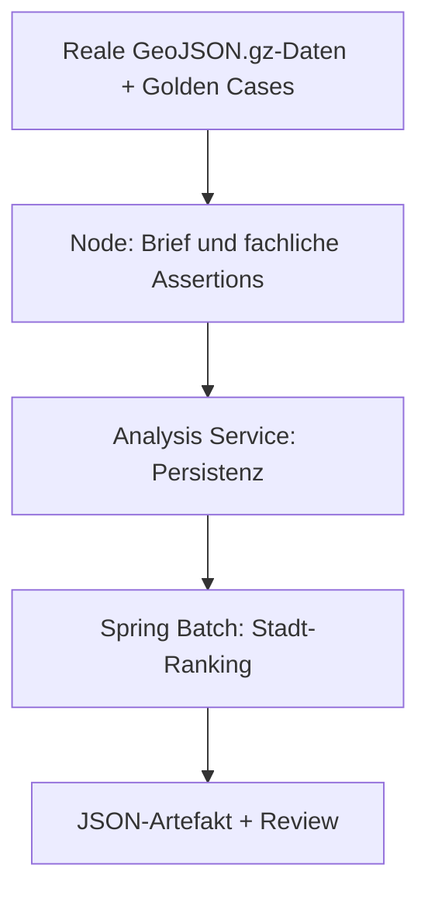

# Golden-Case-QA für Location Action Briefs

Diese QA beantwortet die fachliche Kernfrage aus [Issue #296](https://github.com/carstenartur/Unfallatlas/issues/296): Erzeugt die vorhandene Pipeline aus realen Bonn-/Hannover-Unfalldaten plausible, zurückhaltend formulierte Maßnahmenfälle und ordnet Positivfälle vor dünn belegten Kontrollfällen ein?

## Aktueller Befund

Der schnelle Vorlauf vom 18. Juli 2026 ist für alle sechs definierten Fälle grün. Beide Städte enthalten zwei Positivfälle und einen Negativfall. Innerhalb jeder Stadt liegen die Positivfälle auf Rang 1 und 2, der Null-Unfall-Kontrollfall auf Rang 3.

| Stadt | Fall | Typ | Unfälle | Getötet/schwer | Vorlauf-Rang | Erwartete Kernaussage | Ergebnis |
|---|---|---:|---:|---:|---:|---|---|
| Bonn | `bonn-hbf-rail-bike-solo` | positiv | 262 | 30 | 1 | Schienen-/Oberflächenmuster und passende Infrastrukturmaßnahmen | bestanden |
| Bonn | `bonn-school-crossing` | positiv | 210 | 18 | 2 | Schulumfeld-/Querungsdruck und passende Querungsmaßnahmen | bestanden |
| Bonn | `bonn-control-low-data` | negativ | 0 | 0 | 3 | niedrige Konfidenz; keine Schienen- oder Schulwegmaßnahme | bestanden |
| Hannover | `hannover-turning-conflict` | positiv | 37 | 8 | 1 | Rad/Kfz-Abbiegekonflikt und Sicht-/Knotenmaßnahmen | bestanden |
| Hannover | `hannover-lkw-context` | positiv | 212 | 18 | 2 | Lkw-/Lieferverkehrskontext und passende Rad-/Lkw-Maßnahmen | bestanden |
| Hannover | `hannover-control-low-data` | negativ | 0 | 0 | 3 | niedrige Konfidenz; keine Schienen- oder Schulwegmaßnahme | bestanden |

„Bestanden“ bedeutet hier: Die im Golden Case ausdrücklich geforderten Muster besitzen konkrete Evidenz, mindestens eine erwartete Maßnahme ist Kandidat oder Empfehlung, verbotene Kausalbehauptungen fehlen, `whyPreselected` ist spezifisch, und schwache Daten werden als solche ausgewiesen. Es bedeutet nicht, dass die Software Unfallursachen beweist.

## Zwei verbindliche Prüfstufen



### 1. Schneller fachlicher Vorlauf

Der Vorlauf benötigt nur Node.js und die im Checkout enthaltenen gzip-komprimierten Daten:

```bash
npm run qa:location-brief-golden
```

Er erzeugt:

- `out/qa/location-brief-golden-preflight.json`
- `out/qa/location-brief-golden-preflight.md`

Er prüft die echte Auswahl der Unfallpunkte, die deterministische Brief-Berechnung, Konfliktmuster, Evidenz, Maßnahmen, Begründungen, Konfidenz und eine lokale Score-Reihenfolge. Die zugehörige Jest-Regression läuft als Teil der normalen Unit-Suite.

### 2. Vollständiger Testcontainers-Lauf

Die bindende End-to-End-Prüfung benötigt Docker, aber keine GitHub-spezifische Umgebung:

```bash
GOLDEN_CASE_QA_ARTIFACT_PATH=out/qa/location-brief-golden-cases.json \
  npm run test:location-brief-golden:tc
```

Der Test führt dieselben Fälle durch folgende Komponenten:

1. Node berechnet den Location Action Brief.
2. Der Spring-Boot-Analysis-Service wird durch Testcontainers gestartet.
3. Die Briefs werden über die reale Ingest-API persistiert.
4. Der City-Prioritization-Job wird gestartet.
5. Das persistierte Ranking wird fachlich geprüft und als JSON geschrieben.

Liegt bereits ein ausführbares Analysis-Service-JAR unter
`analysis-service/target/`, startet Testcontainers dieses direkt in einem
Java-21-Container. Andernfalls baut der Test lokal das vorhandene
`analysis-service/Dockerfile`; ein separates Maven auf dem Host ist für den
lokalen npm-Einstieg daher nicht erforderlich.

Der Job `location-brief-golden-qa` in `.github/workflows/test.yml` ruft ausschließlich diesen lokal ausführbaren npm-Einstieg auf und lädt den Bericht als Artefakt `location-brief-golden-case-qa` hoch. GitHub Actions ist damit Ausführungsumgebung, nicht Testimplementierung.

## Rollen der Komponenten

Der Test macht eine wichtige Architekturgrenze sichtbar:

- Node berechnet heute die fachlichen Location Action Briefs.
- `POST /api/location-briefs/compute-and-store` des Analysis Service ist weiterhin ein transparenter Persistenz-Stub; der Test behauptet keine Java-seitige Fachberechnung.
- Der Analysis Service persistiert Briefs und Profil-Scores.
- Spring Batch erzeugt daraus das stadtweite Ranking-Artefakt.

## Review der zusätzlichen Muster

Die Pflichtmuster werden vollständig erkannt; im Vorlauf fehlt kein erwartetes Muster. Daneben erscheinen zusätzliche Hypothesen, die nicht automatisch als bestätigt behandelt werden dürfen:

| Fall | Zusätzlich erkannt | Review-Einordnung |
|---|---|---|
| Bonn Hbf | Fußverkehrskonflikt, linearer Korridor | Im großen Bahnhofs-Bounding-Box plausibel, aber nicht Teil des Goldstandards; vor Ort und anhand detaillierter Unfallhergänge prüfen. |
| Bonn Schule | linearer Korridor, Rad-Alleinunfall/Oberfläche | Kann durch die breite Innenstadt-Auswahl übersteuern; als mögliche False Positives beobachten. |
| Hannover Abbiegekonflikt | Fußverkehr, Korridor, Sicht/Parken | Sicht/Parken passt fachlich zum Knoten, die Korridor-Hypothese ist weniger spezifisch und bleibt sekundär. |
| Hannover Lkw | Korridor, Rad-Alleinunfall/Oberfläche | Lkw-Muster und Maßnahmen passen; Oberflächenhypothese ist nicht durch Unfallhergänge bestätigt. |

Aktuell gibt es im definierten Erwartungsumfang keine False Negatives. Potenzielle False Positives betreffen vor allem generische Sekundärmuster in relativ großen Bounding Boxes. Sie sind deshalb im Brief als Hypothesen mit Vor-Ort-Prüfung zu behandeln und nicht als Unfallursachen.

## Im Lauf gefundene und behobene Qualitätslücken

Der erste reproduzierbare Vorlauf war nur für drei von sechs Fällen grün. Zwei Ursachen wurden anschließend behoben:

- Der Location-Brief-Summarizer verstand nur ein älteres, verschachteltes Verkehrsrelevanzformat und ignorierte das kanonische `PoliticalReference`-Format des Portal-Services. Nun zählen ausschließlich kanonisch verkehrsrelevante Treffer mit bestandenem hartem Orts-/Themen-Gate; ein einzelner einschlägiger Antrag ergibt `policyReadiness=medium`.
- `mon_followup` wurde bei Null-Unfall-Fällen generisch begründet. Die Maßnahme referenziert nun ausdrücklich `datenlage_unzureichend`, sodass die Empfehlung als längerer Beobachtungs-/Prüfbedarf und nicht als beliebige Standardmaßnahme nachvollziehbar ist.
- Der erste Containerlauf machte außerdem eine veraltete Jackson-2-Property sichtbar, durch die das Spring-Boot-4-JAR beim realen Start abbrach. Die Datumsoption nutzt nun den Jackson-3-Namensraum `spring.jackson.datatype.datetime.*`; ein Maven-Konfigurationsvertrag und der Container-Health-Gate sichern den Startpfad ab.

## Grenzen

- Unfallzahlen und Bounding Boxes stammen aus den realen Repository-Daten; ausgewählte Kontext-Hinweise und politische Referenzen sind kuratierte Fixture-Eingaben.
- Die QA beweist daher noch nicht, dass Schienen-, Schul-, Lkw- oder Oberflächenhinweise vollständig automatisch aus allen Rohdaten entdeckt werden.
- `expectedTopN` wird nur gegen die sechs definierten Fälle geprüft, nicht gegen ein flächendeckend erzeugtes Ranking sämtlicher möglicher Stadtbereiche.
- Eine fachliche Ortsprüfung bleibt erforderlich. Amtliche Unfallatlasdaten enthalten keine vollständigen Unfallhergänge und erlauben keine Kausalaussagen.

## Pflege des Goldstandards

Änderungen an Bounding Boxes oder Erwartungen müssen fachlich begründet werden. Erwartungen dürfen nicht nur angepasst werden, um eine Regression grün zu machen. Bei einem Fehlschlag ist zuerst zu unterscheiden zwischen Datenänderung, Mustererkennung, Maßnahmenmapping, Scoring, Persistenz und Ranking. Der JSON-Bericht enthält dafür pro Fall die beobachteten Muster, Maßnahmen, Scores, Ränge und fehlgeschlagenen Checks.
